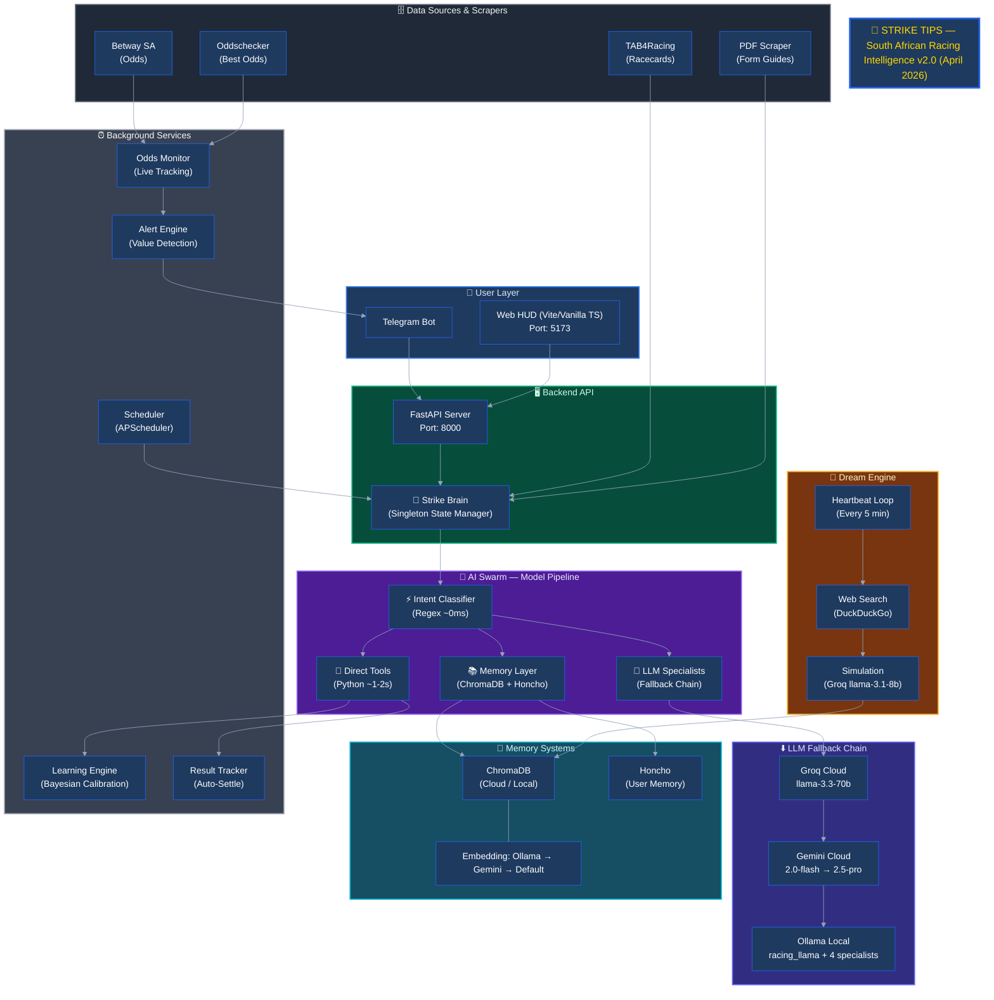

# 🏇 Strike Tips

**South African Horse Racing Intelligence System**


A modular, AI-powered betting assistant that identifies value bets in South African horse racing using probability edge analysis and disciplined bankroll management.


---

## 🎯 What is Strike Tips?

Strike Tips is a "God Mode" betting intelligence system built on a modular architecture:

- **🏇 Race Analysis** - Identifies value bets using probability edge (not tips, *mathematical advantage*)
- **💰 Smart Bankroll Manager** - Enforces disciplined staking (max 5% per bet, daily loss limits)
- **🤖 AI Agents** - Model Pipeline with specialist models for fast responses
- **📱 Telegram Notifications** - Sends tips and updates directly to your phone
- **🔧 Self-Healing Parsers** - Adapts when racing websites change structure
- **⏰ Automated Scheduling** - Daily scans at your preferred time
- **🧠 Dual Memory System** - Combines ChromaDB for race intelligence RAG (local/cloud) and Honcho for user/agent memory with background reasoning, using local Ollama embeddings with Gemini fallback
- **🔄 Auto-Result Updates** - Automatically settles bets when races complete

---

## 🏛️ Architecture



---

## 🚀 Quick Start

### Option A: Docker (Recommended)

```bash
# 1. Clone the repository
git clone https://github.com/Gmpho/strike-tips-autonomous-.git
cd strike-tips-autonomous-

# 2. Start all containers (strike-bot, ollama, odds-monitor)
docker compose up -d

# 3. Check status
docker ps

# 4. View logs
docker logs -f strike-bot

# 5. API available at http://localhost:8000
#    Swagger docs at http://localhost:8000/docs
```

**What's started:**
- `strike-bot`: FastAPI on port 8000
- `ollama`: Local LLM on port 11434
- `odds-monitor`: Playwright scraper

## 🔌 Betting API Endpoint Map (Canonical)

Use explicit betting endpoints to avoid route drift between backend and frontend.

| Purpose | Method | Endpoint |
|---------|--------|----------|
| Betting route index (lightweight discovery) | `GET` | `/api/betting/` |
| Full bet history | `GET` | `/api/betting/history` |
| Open bets only | `GET` | `/api/betting/open` |
| Betting statistics | `GET` | `/api/betting/stats` |
| Account summary / bankroll state | `GET` | `/api/betting/account-summary` |
| Place bet | `POST` | `/api/betting/place` |
| Settle bet | `POST` | `/api/betting/settle` |

Notes:
- Do **not** depend on implicit root-list behavior for history.
- Frontend should call explicit endpoints such as `/api/betting/history` and `/api/betting/account-summary`.

---

### Option B: Deploy on Modal (Serverless)

```bash
# 1. Install Modal
pip install modal
modal setup

# 2. Deploy
python deploy_modal.py

# 3. Done! Runs daily at 11 AM automatically
```

**Cost:** ~$0.60/month (well within Modal's free $30 credit)

See [MODAL_README.md](MODAL_README.md) for details.

---

### Option C: Manual Setup (Development)

```bash
# 1. Clone the repository
git clone https://github.com/Gmpho/strike-tips-autonomous-.git
cd strike-tips-autonomous-

# 2. Start Backend
cd core_agent
python -m venv venv
source venv/bin/activate  # On Windows: venv\Scripts\activate
pip install -r requirements.txt
python api.py

# 3. Start Frontend (New terminal)
cd strike-tips-hud
npm install
npm run dev
```

### 2. Configuration

```bash
# Copy environment template
cp .env.example .env

# Edit .env with your settings
nano .env
```

**Required:**
- `TELEGRAM_BOT_TOKEN` - Get from [@BotFather](https://t.me/botfather)
- `TELEGRAM_CHAT_ID` - Get from [@userinfobot](https://t.me/userinfobot)

### 3. Test Connection

```bash
python scheduler.py test
```

### 4. Run Immediate Scan

```bash
python scheduler.py scan
```

### 5. Start Automated Scheduler

```bash
# Run daily at 11:00 AM (default)
python scheduler.py start

# Or specify custom time
python scheduler.py start --time 10:30
```

---

## 📊 How Value Betting Works

### The Mathematics

```
Implied Probability = 1 / Decimal Odds
Edge = Your Estimated Probability - Implied Probability

If Edge > 5% → VALUE BET
```

### Example

| Horse | Market Odds | Implied Prob | Your Estimate | Edge | Action |
|-------|-------------|--------------|---------------|------|--------|
| Horse A | 5.0 | 20% | 32% | +12% | ✅ VALUE |
| Horse B | 3.0 | 33% | 30% | -3% | ❌ NO BET |
| Horse C | 8.0 | 12.5% | 25% | +12.5% | ✅ VALUE |

### Kelly Criterion Staking

```
Full Kelly = (bp - q) / b
where: b = odds - 1, p = your probability, q = 1 - p

Strike Tips uses Half-Kelly (0.5x) for safety
Capped at 5% of bankroll per bet
```

---

## 🏇 South African Tracks Supported

| Track | Location | Racing Days |
|-------|----------|-------------|
| **Turffontein** | Johannesburg | Saturday |
| **Kenilworth** | Cape Town | Wednesday, Saturday |
| **Vaal** | Vereeniging | Tuesday, Thursday |
| **Greyville** | Durban | Friday, Sunday |
| **Fairview** | Port Elizabeth | Monday, Friday |
| **Flamingo Park** | Kimberley | Thursday, Saturday |
| **Scottburgh** | KZN | Occasional |

---

## 💰 Bankroll Discipline Rules

### Hard Limits (Non-Negotiable)

```python
MAX_BET_PERCENT = 5.0        # Never bet more than 5% on single race
DAILY_LOSS_LIMIT = 20.0      # Stop after 20% daily loss
MAX_DRAWDOWN = 50.0          # Stop if down 50% from peak
KELLY_FRACTION = 0.5         # Use Half-Kelly (conservative)
```

### Example Bankroll Management

Starting Bankroll: **R1,000**

| Scenario | Calculation | Stake |
|----------|-------------|-------|
| Strong edge (15%+) | 7% of R1,000 | R70 (capped to R50) |
| Value edge (5-15%) | 5% of R1,000 | R50 |
| Marginal edge (3-5%) | 3% of R1,000 | R30 |

---

## 🛠️ CLI Commands

### Main Commands

```bash
# Daily scan of all tracks
python strike_tips.py scan

# Analyze specific track
python strike_tips.py track --track turffontein

# Place a bet manually
python strike_tips.py bet \
    --track turffontein \
    --race 1 \
    --horse "Horse Name" \
    --odds 5.0 \
    --edge 12.5

# Settle a bet
python strike_tips.py settle --bet-id <bet_id> --won

# Check bankroll status
python strike_tips.py status

# Generate daily report
python strike_tips.py report
```

### Scheduler Commands

```bash
# Start automated scheduler
python scheduler.py start

# Run immediate scan
python scheduler.py scan

# Test connections
python scheduler.py test
```

---

## 📱 Telegram Bot Screenshots

  
  

### Message Types

1. **Daily Tips Summary** - Morning scan results
2. **Value Bet Alerts** - When strong value is found
3. **Bet Placed Confirmation** - Stake and odds recorded
4. **Race Results** - Win/loss notifications
5. **Bankroll Updates** - Daily P&L and status
6. **Error Alerts** - System issues

### Example Notification

```
🔥 STRIKE TIPS - VALUE BET

📍 Turffontein - Race 3 (14:30)
🐎 Speedy Gonzales
💰 Odds: 6.5 | Edge: +15.2%
💵 Advised Stake: R50.00
📊 Confidence: STRONG_VALUE

📝 Analysis:
Recent form: 1-2-1 | Proven at track/distance

⚠️ Bet responsibly. Max 5% per bet rule applied.
```

---

## 🔧 Self-Healing Parsers

When TAB4Racing changes their website structure:

1. Parser detects selector failures
2. Tracks success/fail rates per selector
3. Falls back to pattern matching
4. Suggests new selectors
5. Can auto-generate patch code

```python
# The parser learns and adapts
parser = SelfHealingParser()
element = parser.find_element(soup, "horse_name")
# Automatically tries multiple selectors
# Updates stats for future use
```

---

## 📁 Project Structure (April 2026 - v2.0)

```
core_agent/                          # Python backend (refactored)
├── agents/                         # AI orchestration layer
│   ├── ai_pydantic.py              # ModelPipeline + UnifiedOrchestrator
│   ├── ai_providers.py             # AI provider routing
│   └── intent_classifier.py        # Regex-based intent detection
├── config/                         # Configuration
│   ├── model_config.py             # Centralized model config
│   └── settings.py                 # Bankroll settings
├── core/                           # Core business logic
│   ├── strike_tips.py              # Main orchestrator
│   ├── strike_brain.py             # Central state manager
│   ├── engine.py                   # Execution engine
│   └── api.py                      # FastAPI entry point
├── skills/                         # Domain skills
│   ├── race_analysis/              # Value bet engine
│   ├── bankroll_manager/           # Bankroll governor
│   ├── parsers/                    # Tab4, PDF scrapers
│   ├── memory/                     # ChromaDB memory
│   ├── learning/                   # Learning engine
│   └── notifications/              # Telegram bot
├── tools/                          # MAF tools
│   └── maf_tool_registry.py       # 11 gambling-free tools
├── routes/                         # API endpoints
│   ├── agent.py, betting.py, racing.py
├── ollama_configs/                 # 5 racing Modelfiles
└── requirements.txt

strike-tips-frontend/               # Next.js frontend (unchanged)
├── src/
│   ├── app/                       # App router pages
│   ├── components/               # React components
│   └── lib/api.ts                # API utilities
└── package.json
```

---

## ⚙️ Configuration Options

### Environment Variables

| Variable | Description | Default |
|----------|-------------|---------|
| `TELEGRAM_BOT_TOKEN` | Bot token from @BotFather | Required |
| `TELEGRAM_CHAT_ID` | Your Telegram chat ID | Required |
| `STARTING_BANKROLL` | Initial bankroll (ZAR) | 1000 |
| `MAX_BET_PERCENT` | Max % per bet | 5 |
| `DAILY_LOSS_LIMIT` | Stop after % loss | 20 |
| `DATA_DIR` | Data storage path | ./data |
| `CHROMA_API_KEY` | ChromaDB Cloud API key (for cloud storage) | None |
| `CHROMA_HOST` | ChromaDB Cloud host (e.g., api.trychroma.com) | None |
| `CHROMA_TENANT` | ChromaDB tenant (optional) | None |
| `CHROMA_DATABASE` | ChromaDB database name | default_database |
| `GEMINI_API_KEY` | Gemini API key for embedding fallback | None |
| `MODEL_EMBEDDER` | Embedding model for Ollama (local) | embeddinggemma:300m |

### Customizing in Code

```python
from config.settings import BankrollConfig

# Custom bankroll settings
custom_config = BankrollConfig(
    total_bankroll=2000.0,
    max_bet_percent=3.0,      # More conservative
    daily_loss_limit=15.0,
    min_edge_threshold=8.0     # Higher edge requirement
)

strike = StrikeTips(bankroll_config=custom_config)
```

---

## 🧪 Testing

```bash
# Run all tests
pytest

# Test specific component
pytest tests/test_analyzer.py

# Test with coverage
pytest --cov=strike_tips
```

---

## 🚨 Important Disclaimer

**Strike Tips is a tool for educational and entertainment purposes.**

- Past performance does not guarantee future results
- The house always has an edge
- Never bet more than you can afford to lose
- Gambling can be addictive - seek help if needed
- This tool does not guarantee profits

**South African Responsible Gambling:**
- National Responsible Gambling Programme: 0800 006 008
- Website: www.responsiblegambling.org.za

---

## 🤝 Contributing

1. Fork the repository
2. Create a feature branch (`git checkout -b feature/amazing`)
3. Commit changes (`git commit -m 'Add amazing feature'`)
4. Push to branch (`git push origin feature/amazing`)
5. Open a Pull Request

---

## 📜 License

MIT License - see [LICENSE](LICENSE) file

---

## 🙏 Acknowledgments

- South African racing data from [TAB4Racing](https://www.tab4racing.com)
- Inspired by value betting and Kelly Criterion principles
- Built for SA racing enthusiasts

---

## 📞 Support

- Issues: [GitHub Issues](https://github.com/Gmpho/strike-tips-autonomous-/issues)
- Telegram: [@StrikeTipsBot](https://t.me/StrikeTipsBot)
- HUD: [https://strike-tips-hud.vercel.app/](https://strike-tips-hud.vercel.app/)

---

**🏇 Bet Smart. Bet Disciplined. Strike Tips. please note this for education and entertainment only**
