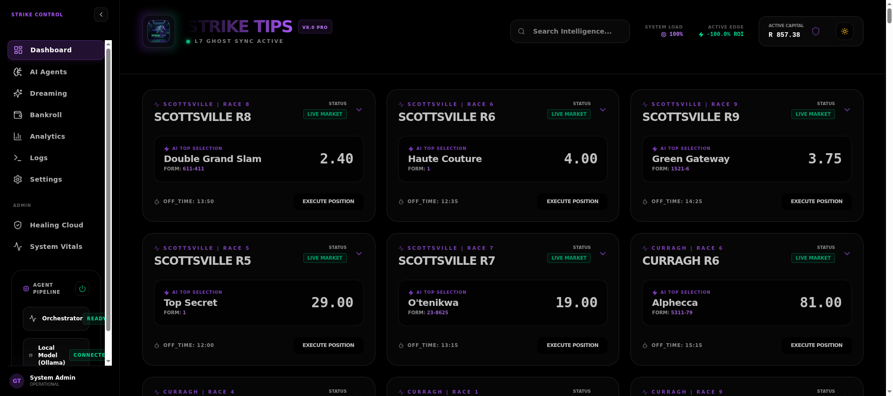
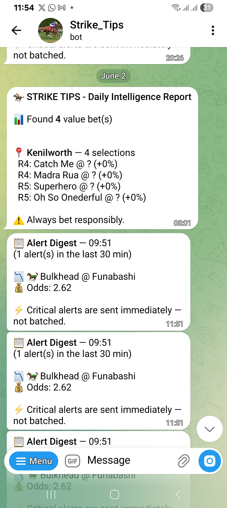
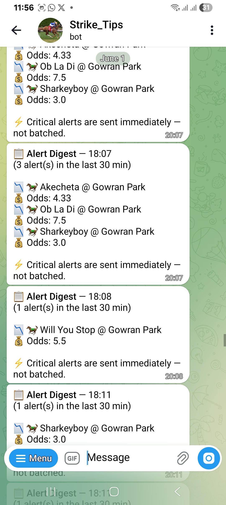
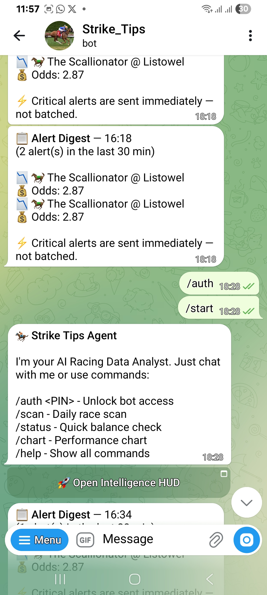
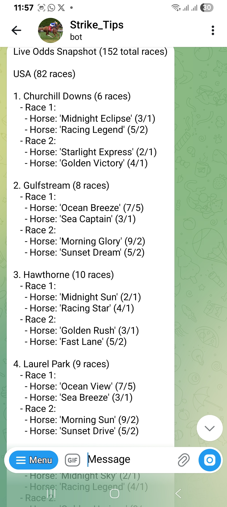
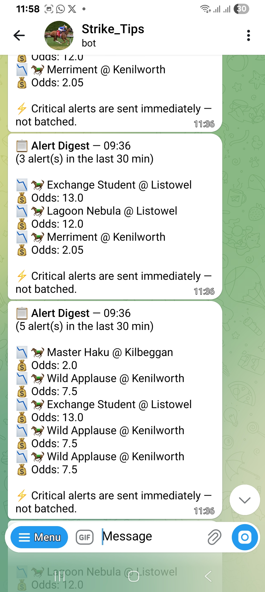
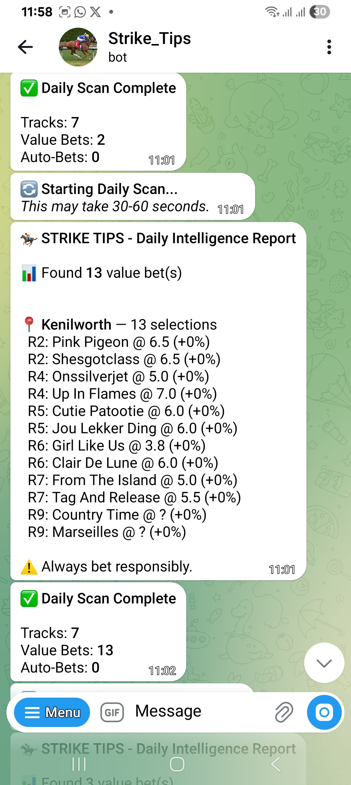

# 🏇 Strike Tips

**South African Horse Racing Intelligence System**



A modular, AI-powered betting assistant that identifies value bets in South African horse racing using probability edge analysis and disciplined bankroll management.

**3-Layer Architecture:** Cloudflare edge (always-free) → Modal serverless backend → Vercel frontend, with an OKF (On-Device Knowledge) bundle of 12 curated SA racing docs.


---

## 🎯 What is Strike Tips?

Strike Tips is a "God Mode" betting intelligence system built on a modular architecture:

- **🏇 Race Analysis** - Identifies value bets using probability edge (not tips, *mathematical advantage*)
- **💰 Smart Bankroll Manager** - Enforces disciplined staking (max 5% per bet, daily loss limits)
- **🤖 AI Agents** - Model Pipeline with specialist models for fast responses
- **📱 Telegram Notifications** - Sends tips and updates directly to your phone
- **🔧 Self-Healing Parsers** - Adapts when racing websites change structure
- **⏰ Automated Scheduling** - Daily scans at your preferred time
- **🧠 Dual Memory System** - Combines ChromaDB for race intelligence RAG (local/cloud) and Honcho for user/agent memory with background reasoning, using local Ollama embeddings with Gemini fallback
- **🔄 Auto-Result Updates** - Automatically settles bets when races complete
- **🧠 Bayesian Learning Engine** - Beta-Binomial updating blends simulated dreams with real settled outcomes; `decay = e^{-0.15 × real_bets}` makes simulation influence fade with real-world data
- **🎲 Deterministic Dream Engine** - Physical adjustments (Going/Rain, Wind, Scratches) replace random shifts; persisted to ChromaDB with metadata tags
- **📊 Dream Stress Index (DSI)** - Scales Half-Kelly staking defensively: DSI < 20% → 1.0x, 20-50% → 0.75x, > 50% → 0.50x (Quarter-Kelly)
- **🌐 WebGPU Search Grounding** - Local browser models fetch live context (odds, runners, ChromaDB insights, DDG search) via `/api/agent/context` before inference
- **📱 Telegram `/dream` Command** - `/dream <track> race <num> - <scenario>` runs custom simulations and returns edge change reports directly to chat
- **📰 Racing News Feed** - Zero-cost live headlines from BBC Sport, The Guardian & Daily Mirror RSS — polled by the Swarm Researcher, streamed to the HUD over SSE with a lazy image proxy (no API keys)
- **🐝 Swarm Researcher (All-Region Form Insights)** - Backfills form commentary for every region Betway's Timeform doesn't cover (USA, Japan, South Africa, Australia, NZ, Hong Kong…): free deterministic field blurbs for all runners, web-grounded Groq summaries gated to aiSelections/movers/short-priced (max 6 calls/cycle), persisted to ChromaDB learning memory and surfaced in the HUD with region chips + reliability badges
- **📡 Live Ops Telemetry** - Dedicated sidebar tab streaming real-time engine activity (Swarm Researcher, News RAG, Dreaming Engine, Governor DSI adjustments) over SSE — engine status cards + live activity stream, zero polling ([docs](docs/LIVE_OPS_TELEMETRY.md))
- **📊 RaceCard Table Upgrades** - Sortable columns, full-width collapsible insight banners, per-row model Edge column, one-click ⚡ per runner into AI chat, and a live Dream Stress Index chip on the race header

---

## 🏛️ Architecture

## 3-Layer Architecture (v2.1)

```
                    ┌─────────────────────────────────────┐
                    │     VERCEL HUD (Frontend)           │
                    │  https://strike-tips-hud.vercel.app  │
                    │                                     │
                    │  Vite + React 19 + Three.js         │
                    │  middleware.ts routes API calls      │
                    └──────────────┬──────────────────────┘
                                   │
                    ┌──────────────┴──────────────────────┐
                    │           MIDDLEWARE.TS              │
                    │  Cloudflare paths → CF Worker        │
                    │  All other paths → Modal             │
                    └──────┬──────────────────────┬────────┘
                           │                      │
              ┌────────────▼────────┐    ┌────────▼───────────────────┐
              │  CLOUDFLARE EDGE    │    │  MODAL BACKEND             │
              │  (Always Free)      │    │  (Serverless, ~$30/mo)     │
              │                     │    │                            │
               │  ● 16 MCP tools     │    │  ● FastAPI (serve-api)     │
               │  ● 13 REST endpoints│    │  ● Telegram bot            │
               │  ● OKF knowledge    │    │  ● AI analysis (Gemini)    │
               │  ● D1 database      │    │  ● Dream engine (Bayesian) │
               │  ● KV odds cache    │    │  ● DSI Kelly scaling       │
               │  ● Web search tool  │    │  ● ChromaDB memory         │
               │                     │    │  ● Odds processing         │
               │                     │    │  ● Context API/WebGPU      │
               └─────────────────────┘    └────────────────────────────┘
```

---

---

## ☁️ Cloudflare Edge Layer

The Cloudflare Worker (`cloudflare_mcp_edge/`) handles all compute-light operations at zero cost:

### OKF Knowledge Bundle
12 curated SA racing knowledge files compiled to TypeScript at build time:

| Category | Files | Contents |
|----------|-------|----------|
| **Tracks** | 7 files | Kenilworth, Durbanville, Fairview, Turffontein, Vaal, Scottsville, Greyville — real data (founded, features, draw bias) |
| **Conditions** | 1 file | Going & track conditions explained |
| **Strategies** | 2 files | Value betting & Kelly Criterion with SA context |

Search ranks by keyword match (10x title/tags, 5x body, + per-occurrence).

### MCP Tools (16 total)

| Category | Tools |
|----------|-------|
| **Original** (11) | probability edge, Kelly staking, circuit breakers, Bayesian calibration, keyword scan, race evaluation, card verification, HTML patch, form search, dream sim, odds fetch |
| **OKF** (4) | search, list, get by path, get track by name |
| **Web** (1) | web search (requires `SEARCH_API_KEY` secret) |

### REST Endpoints (13)
`/api/health`, `/api/edge`, `/api/kelly`, `/api/circuit`, `/api/bayesian`, `/api/keywords`, `/api/evaluate`, `/api/verify-card`, `/api/patch-html`, `/api/racing/form`, `/api/racing/odds`, `/api/knowledge`, `/api/knowledge/search`, `/api/knowledge/tracks`

### Data Layer
- **D1 Database**: 244 form insights, parameterized queries
- **KV Cache**: Live odds pushed by Docker odds-monitor (TTL 300s)
- **Ingestion**: `POST /api/ingest-snapshot` for odds, `POST /api/ingest-insight` for form

See [`docs/CLOUDFLARE_MCP_EDGE.md`](docs/CLOUDFLARE_MCP_EDGE.md) for full details.

---

## 📰 Racing News Pipeline

Zero-cost, key-free news pipeline powering the HUD **News** sidebar (`/news`):

```
RSS Feeds (BBC Sport / Guardian / Mirror)
        │  poll_news() — every 10 min (Swarm Researcher background loop,
        │  started by AdaptiveOddsMonitor; no LLM calls on the news path)
        ▼
data/news_latest.json  (deduped, capped, atomic tmp+rename writes)
        │
        ├─► GET /api/news            → { items: [...], count }   (REST, initial hydration)
        ├─► GET /api/monitoring/stream → SSE event: news          (live updates on change)
        └─► GET /api/news/images?url= → lazy image proxy          (allow-listed CDN hosts,
                                       fetched on first view, cached to disk 7 days)
```

**Frontend flow:** `DataBridge` is the single source of truth — it hydrates the store via REST on startup, then keeps it fresh from the SSE `news` event. `NewsView` renders from the store only (no duplicate fetching). Summaries are HTML-stripped client-side (Guardian embeds markup).

Both `/api/news`, `/api/news/images` and the SSE stream are in `SAFE_PATHS` (no API key) since `EventSource` cannot send custom headers.

---

## 📡 Live Ops — Engine Telemetry

Dedicated sidebar tab (`/telemetry`, 📡 next to News) streaming real-time background-engine activity:

```
emit(engine, message) from Swarm Researcher / News poller / Dream heartbeat / Governor
        │  core_agent/core/telemetry.py — in-memory ring buffer (100 events)
        │  + best-effort Redis fanout on agent:telemetry
        ▼
GET /api/monitoring/stream → SSE event: telemetry   (one shared connection)
GET /api/telemetry         → REST hydration         (newest-first, max 30)
        ▼
DataBridge → hudStore.telemetry → Live Ops tab
```

The tab shows one **status card per engine** (Active/Idle + relative time + latest message) for the four engines — Swarm Researcher, News RAG, Dreaming Engine, Governor — plus a chronological activity stream. The Governor's DSI adjustments are also persisted per track:race (`data/dsi_cache.json`) and stamped onto snapshot events, rendering a stress chip (🟢 <20% / 🟠 20–50% / 🔴 >50%) on RaceCards. Full details: [`docs/LIVE_OPS_TELEMETRY.md`](docs/LIVE_OPS_TELEMETRY.md).

---

## 🔌 Backend Failover (Modal ↔ Tunnel ↔ Local)

The HUD survives backend outages (e.g. Modal credit gaps) via automatic origin failover:

- **`middleware.ts`** validates each backend with a real `/api/system/health` probe (a suspended Modal answers 404 fast — that's *not* healthy) and routes to `BACKEND_FALLBACK_ORIGIN` when the primary is dark.
- **`data-bridge.ts`** probes SSE origins in order (dev same-origin → Modal → `VITE_SSE_FALLBACK_ORIGIN`) with a 60s negative cache on dark origins.
- Current bridge: **Cloudflare tunnel → local Docker** (same FastAPI, same scrapers). Cloud Run deploy is prepared in `deploy-cloud-run.sh`, pending GCP billing.

⚠️ During a failover window, bet history/analytics shown come from the **fallback's** data copy — the canonical Modal Volume (`strike-tips-data`) and ChromaDB Cloud persist untouched and return automatically when Modal does. Full details + Sept-1 reconciliation checklist: [`docs/FAILOVER_BRIDGE.md`](docs/FAILOVER_BRIDGE.md).

---

## 🐝 Swarm Researcher — Form Insights for Every Region

Betway only publishes Timeform prose (`timeForm`) + star ratings for **UK/Ireland** cards — USA, Japan, South Africa, Australia, NZ and Hong Kong runners arrive with empty commentary. The Swarm Researcher (`core_agent/skills/swarm_researcher.py`) fills that gap for **all regions**, on a strict no-waste budget:

```
AdaptiveOddsMonitor (every 10 min, alongside heartbeat)
        │
        ├─ Pass A: backfill_form_insights()
        │    1. Chroma freshness gate  — skip horses with today's insight already stored
        │    2. Field blurb (FREE)     — deterministic facts from live runner fields:
        │                               form string, draw, age/weight, jockey, trainer, odds
        │    3. Web grounding (GATED)  — ONLY aiSelections + movers + odds ≤ 6.0:
        │                               search_racing_data() → Groq factual summary
        │                               (max 6 Groq calls/cycle, cached by horse+date)
        │    ▼
        │    data/swarm_insights.json (per-outcomeId) + ChromaDB form_insights
        │    metadata {type:"racing_insight", region, source:"field_only"|"web", ts}
        │    + curated_memory.append_agent_note()
        │
        └─ Pass B: poll_news()  → see News Pipeline above

Snapshot enrichment (inline, every monitor cycle):
enrich_snapshot_with_insights(state) injects per-runner
region / swarmInsight / insightSource before set_snapshot → SSE push
```

**Region detection:** derived from the Betway display prefix (`"USA: Saratoga"`, `"South Africa: Turffontein"`) with course-keyword fallbacks — covers USA, Japan, South Africa, UK/IRE, Australia, New Zealand, France, Hong Kong, UAE.

**HUD surfaces:**
- **RaceCard** — region chip + expandable insight (🔥 Timeform for UK/IRE, 🌐 Swarm for everywhere else)
- **Market Movers** — insight strip + reliability badge (✅ Verified = web-grounded, ⚠️ Baseline = field-only)
- **Predictor** — LiveMarketStrip shows region + swarm insight in the detail modal and expanded cards

---

## 🚀 Quick Start

### Option A: Deploy Cloudflare Worker + Vercel HUD (Cloud-Native)

```bash
# 1. Deploy Cloudflare Worker (always-free edge)
cd cloudflare_mcp_edge
node scripts/build-knowledge.js
npm run deploy

# 2. Deploy Vercel HUD (frontend)
cd ../strike-tips-hud
vercel deploy --prod -y --force

# 3. Visit https://strike-tips-hud.vercel.app
```

### Option B: Docker (Local Development)

```bash
# 1. Clone the repository
git clone https://github.com/Gmpho/strike-tips-autonomous-.git
cd strike-tips-autonomous-

# 2. Start all containers (strike-bot, ollama, odds-monitor)
docker compose up -d

# 3. Check status
docker ps

# 4. View logs
docker logs -f strike-bot

# 5. API available at http://localhost:8000
#    Swagger docs at http://localhost:8000/docs
```

**What's started:**
- `strike-bot`: FastAPI on port 8000
- `ollama`: Local LLM on port 11434
- `odds-monitor`: Playwright scraper

## 🔌 Betting API Endpoint Map (Canonical)

Use explicit betting endpoints to avoid route drift between backend and frontend.

| Purpose | Method | Endpoint |
|---------|--------|----------|
| Betting route index (lightweight discovery) | `GET` | `/api/betting/` |
| Full bet history | `GET` | `/api/betting/history` |
| Open bets only | `GET` | `/api/betting/open` |
| Betting statistics | `GET` | `/api/betting/stats` |
| Account summary / bankroll state | `GET` | `/api/betting/account-summary` |
| Place bet | `POST` | `/api/betting/place` |
| Settle bet | `POST` | `/api/betting/settle` |

Notes:
- Do **not** depend on implicit root-list behavior for history.
- Frontend should call explicit endpoints such as `/api/betting/history` and `/api/betting/account-summary`.

---

### Option B: Deploy on Modal (Serverless)

```bash
# 1. Install Modal
pip install modal
modal setup

# 2. Deploy
python deploy_modal.py

# 3. Done! Runs daily at 11 AM automatically
```

**Cost:** ~$0.60/month (well within Modal's free $30 credit)

See [docs/MODAL_README.md](docs/MODAL_README.md) for details.

---

### Option C: Manual Setup (Development)

```bash
# 1. Clone the repository
git clone https://github.com/Gmpho/strike-tips-autonomous-.git
cd strike-tips-autonomous-

# 2. Start Backend
cd core_agent
python -m venv venv
source venv/bin/activate  # On Windows: venv\Scripts\activate
pip install -r requirements.txt
python api.py

# 3. Start Frontend (New terminal)
cd strike-tips-hud
npm install
npm run dev
```

### 2. Configuration

```bash
# Copy environment template
cp .env.example .env

# Edit .env with your settings
nano .env
```

**Required:**
- `TELEGRAM_BOT_TOKEN` - Get from [@BotFather](https://t.me/botfather)
- `TELEGRAM_CHAT_ID` - Get from [@userinfobot](https://t.me/userinfobot)

### 3. Test Connection

```bash
python scheduler.py test
```

### 4. Run Immediate Scan

```bash
python scheduler.py scan
```

### 5. Start Automated Scheduler

```bash
# Run daily at 11:00 AM (default)
python scheduler.py start

# Or specify custom time
python scheduler.py start --time 10:30
```

---

## 📊 How Value Betting Works

### The Mathematics

```
Implied Probability = 1 / Decimal Odds
Edge = Your Estimated Probability - Implied Probability

If Edge > 5% → VALUE BET
```

### Example

| Horse | Market Odds | Implied Prob | Your Estimate | Edge | Action |
|-------|-------------|--------------|---------------|------|--------|
| Horse A | 5.0 | 20% | 32% | +12% | ✅ VALUE |
| Horse B | 3.0 | 33% | 30% | -3% | ❌ NO BET |
| Horse C | 8.0 | 12.5% | 25% | +12.5% | ✅ VALUE |

### Kelly Criterion Staking

```
Full Kelly = (bp - q) / b
where: b = odds - 1, p = your probability, q = 1 - p

Strike Tips uses Half-Kelly (0.5x) for safety
Capped at 5% of bankroll per bet
```

---

## 🏇 South African Tracks Supported

| Track | Location | Racing Days |
|-------|----------|-------------|
| **Turffontein** | Johannesburg | Saturday |
| **Kenilworth** | Cape Town | Wednesday, Saturday |
| **Vaal** | Vereeniging | Tuesday, Thursday |
| **Greyville** | Durban | Friday, Sunday |
| **Fairview** | Port Elizabeth | Monday, Friday |
| **Flamingo Park** | Kimberley | Thursday, Saturday |
| **Scottburgh** | KZN | Occasional |

---

## 💰 Bankroll Discipline Rules

### Hard Limits (Non-Negotiable)

```python
MAX_BET_PERCENT = 5.0        # Never bet more than 5% on single race
DAILY_LOSS_LIMIT = 20.0      # Stop after 20% daily loss
MAX_DRAWDOWN = 50.0          # Stop if down 50% from peak
KELLY_FRACTION = 0.5         # Use Half-Kelly (conservative)
```

### 🧠 Dream Stress Index (DSI) Kelly Sizing Scale Down

To protect the bankroll from adverse track/weather scenarios, Strike Tips runs Monte Carlo simulations (dreams) in the background. Before placing any real bet, the Bankroll Governor queries ChromaDB for all simulated dreams today for that specific track and distance to calculate the **Dream Stress Index (DSI)**:

$$\text{DSI} = \frac{\text{Simulations where horse failed to maintain edge}}{\text{Total simulations}}$$

Based on the DSI, the Half-Kelly stake is scaled down defensively:
- **DSI < 20%** (Stable Edge): **1.0x** allocation.
- **20% <= DSI <= 50%** (Moderate Risk): **0.75x** allocation.
- **DSI > 50%** (High Volatility / Adverse Conditions): **0.50x** allocation (Quarter-Kelly).

### Example Bankroll Management

Starting Bankroll: **R1,000**

| Scenario | Calculation | Stake |
|----------|-------------|-------|
| Strong edge (15%+) | 7% of R1,000 | R70 (capped to R50) |
| Value edge (5-15%) | 5% of R1,000 | R50 |
| Marginal edge (3-5%) | 3% of R1,000 | R30 |

---

## 🛠️ CLI Commands

### Main Commands

```bash
# Daily scan of all tracks
python strike_tips.py scan

# Analyze specific track
python strike_tips.py track --track turffontein

# Place a bet manually
python strike_tips.py bet \
    --track turffontein \
    --race 1 \
    --horse "Horse Name" \
    --odds 5.0 \
    --edge 12.5

# Settle a bet
python strike_tips.py settle --bet-id <bet_id> --won

# Check bankroll status
python strike_tips.py status

# Generate daily report
python strike_tips.py report
```

### Scheduler Commands

```bash
# Start automated scheduler
python scheduler.py start

# Run immediate scan
python scheduler.py scan

# Test connections
python scheduler.py test
```

---

## 📱 Telegram Bot Screenshots

  
  

### Message Types

1. **Daily Tips Summary** - Morning scan results
2. **Value Bet Alerts** - When strong value is found
3. **Bet Placed Confirmation** - Stake and odds recorded
4. **Race Results** - Win/loss notifications
5. **Bankroll Updates** - Daily P&L and status
6. **Error Alerts** - System issues

### Example Notification

```
🔥 STRIKE TIPS - VALUE BET

📍 Turffontein - Race 3 (14:30)
🐎 Speedy Gonzales
💰 Odds: 6.5 | Edge: +15.2%
💵 Advised Stake: R50.00
📊 Confidence: STRONG_VALUE

📝 Analysis:
Recent form: 1-2-1 | Proven at track/distance

⚠️ Bet responsibly. Max 5% per bet rule applied.
```

---

## 🔧 Self-Healing Parsers

When TAB4Racing changes their website structure:

1. Parser detects selector failures
2. Tracks success/fail rates per selector
3. Falls back to pattern matching
4. Suggests new selectors
5. Can auto-generate patch code

```python
# The parser learns and adapts
parser = SelfHealingParser()
element = parser.find_element(soup, "horse_name")
# Automatically tries multiple selectors
# Updates stats for future use
```

---

## 📁 Project Structure (June 2026 - v2.1)

```
core_agent/                                # Modal backend (Python FastAPI)
├── agents/                               # AI orchestration layer
│   ├── ai_pydantic.py                    # ModelPipeline + UnifiedOrchestrator
│   ├── ai_providers.py                   # AI provider routing
│   └── intent_classifier.py              # Regex-based intent detection
├── config/                               # Configuration
│   ├── model_config.py                   # Centralized model config
│   └── settings.py                       # Bankroll settings
├── core/                                 # Core business logic
│   ├── strike_tips.py                    # Main orchestrator
│   ├── strike_brain.py                   # Central state manager
│   ├── engine.py                         # Execution engine
│   ├── adaptive_odds_monitor.py          # Live odds monitoring
│   └── api.py                            # FastAPI entry point
├── skills/                               # Domain skills
│   ├── race_analysis/                    # Value bet engine
│   ├── bankroll_manager/                 # Bankroll governor (DSI scaling)
│   ├── dreamer.py                        # Dream engine (Bayesian sims)
│   ├── parsers/                          # Tab4, PDF scrapers
│   ├── memory/                           # ChromaDB memory (embedder fix)
│   ├── learning/                         # Learning engine (Beta-Binomial)
│   ├── search_service.py                 # DDG search (thread executor)
│   └── notifications/                    # Telegram bot
├── tools/                                # MAF tools
│   └── maf_tool_registry.py             # 17 gambling-free tools (+dream tools)
├── agent/                                # AI orchestration
│   ├── context.py                        # ContextBuilder (WebGPU grounding)
│   └── loop.py                           # Telegram router (+/dream cmd)
├── routes/                               # API endpoints
│   ├── agent.py, betting.py, racing.py
├── ollama_configs/                       # 5 racing Modelfiles
├── tests/                                # Test suite
│   ├── test_governor.py                  # 5 bankroll tests
│   └── test_dsi_staking.py              # DSI stress test
└── requirements.txt

cloudflare_mcp_edge/                      # Cloudflare Worker (always-free edge)
├── src/
│   ├── index.ts                          # Worker entry (REST + MCP, 564 lines)
│   └── generated/
│       └── racing-knowledge.ts           # Auto-generated OKF bundle (12 entries)
├── knowledge/racing/                     # OKF markdown source
│   ├── index.md                          # 1 bundle index
│   ├── conditions/going.md               # Going conditions
│   ├── strategies/                       # Value betting, Kelly Criterion
│   └── tracks/                           # 7 SA tracks with real data
├── scripts/build-knowledge.js            # Markdown → TypeScript compiler
├── package.json                          # @modelcontextprotocol/sdk v1.29.0
└── wrangler.jsonc                        # D1 + KV bindings

strike-tips-hud/                          # Vite + React + Three.js frontend (Vercel)
├── src/                                  # UI components
├── middleware.ts                         # Routes API calls: Cloudflare vs Modal
├── vercel.json                           # SPA rewrites only
└── package.json
```

---

## ⚙️ Configuration Options

### Environment Variables

| Variable | Description | Default |
|----------|-------------|---------|
| `TELEGRAM_BOT_TOKEN` | Bot token from @BotFather | Required |
| `TELEGRAM_CHAT_ID` | Your Telegram chat ID | Required |
| `STARTING_BANKROLL` | Initial bankroll (ZAR) | 1000 |
| `MAX_BET_PERCENT` | Max % per bet | 5 |
| `DAILY_LOSS_LIMIT` | Stop after % loss | 20 |
| `DATA_DIR` | Data storage path | ./data |
| `CHROMA_API_KEY` | ChromaDB Cloud API key (for cloud storage) | None |
| `CHROMA_HOST` | ChromaDB Cloud host (e.g., api.trychroma.com) | None |
| `CHROMA_TENANT` | ChromaDB tenant (optional) | None |
| `CHROMA_DATABASE` | ChromaDB database name | default_database |
| `GEMINI_API_KEY` | Gemini API key for embedding fallback | None |
| `MODEL_EMBEDDER` | Embedding model for Ollama (local) | embeddinggemma:300m |

### Customizing in Code

```python
from config.settings import BankrollConfig

# Custom bankroll settings
custom_config = BankrollConfig(
    total_bankroll=2000.0,
    max_bet_percent=3.0,      # More conservative
    daily_loss_limit=15.0,
    min_edge_threshold=8.0     # Higher edge requirement
)

strike = StrikeTips(bankroll_config=custom_config)
```

---

## 🧪 Testing

```bash
# Run all tests (30 tests — governor, DSI staking, exotics, selections, pool legs, auto-bet odds)
pytest

# Test specific component
pytest tests/test_governor.py

# DSI stress test
pytest tests/test_dsi_staking.py -v

# Test inside Docker
docker exec strike-bot-new pytest core_agent/tests/

# Test with coverage
pytest --cov=core_agent --cov-report=term-missing
```

---

## 🚨 Important Disclaimer

**Strike Tips is a tool for educational and entertainment purposes.**

- Past performance does not guarantee future results
- The house always has an edge
- Never bet more than you can afford to lose
- Gambling can be addictive - seek help if needed
- This tool does not guarantee profits

**South African Responsible Gambling:**
- National Responsible Gambling Programme: 0800 006 008
- Website: www.responsiblegambling.org.za

---

## 🤝 Contributing

1. Fork the repository
2. Create a feature branch (`git checkout -b feature/amazing`)
3. Commit changes (`git commit -m 'Add amazing feature'`)
4. Push to branch (`git push origin feature/amazing`)
5. Open a Pull Request

---

## 📜 License

MIT License - see [LICENSE](LICENSE) file

---

## 🙏 Acknowledgments

- South African racing data from [TAB4Racing](https://www.tab4racing.com)
- Inspired by value betting and Kelly Criterion principles
- Built for SA racing enthusiasts

---

## 📞 Support

- Issues: [GitHub Issues](https://github.com/Gmpho/strike-tips-autonomous-/issues)
- Telegram: [@StrikeTipsBot](https://t.me/StrikeTipsBot)
- HUD: [https://strike-tips-hud.vercel.app/](https://strike-tips-hud.vercel.app/)
- MCP: `POST https://striketips-mcp.gmphorg379.workers.dev/mcp` (requires `x-api-key` + `Accept: application/json, text/event-stream`)

---

## 📚 Documentation

| Document | Contents |
|----------|----------|
| [`docs/PWA_TWA_GUIDE.md`](docs/PWA_TWA_GUIDE.md) | PWA structure, Service Worker caching, and TWA Play Store packaging |
| [`docs/OLLAMA_BACKGROUND.md`](docs/OLLAMA_BACKGROUND.md) | Ollama background architecture, specialist models, and background workflows |
| [`docs/CLOUDFLARE_MCP_EDGE.md`](docs/CLOUDFLARE_MCP_EDGE.md) | 3-layer architecture, OKF bundle, MCP tools, REST endpoints |
| [`docs/AGENTS.md`](docs/AGENTS.md) | Agent coding guidelines, build commands, project structure |
| [`docs/MCP_INTEGRATION_GUIDE.md`](docs/MCP_INTEGRATION_GUIDE.md) | MCP protocol, n8n integration, Claude Desktop setup |
| [`docs/MODAL_README.md`](docs/MODAL_README.md) | Modal serverless deployment |
| [`docs/MODAL_README.md`](docs/MODAL_README.md) | Modal serverless deployment |
| [`docs/PRIVACY.md`](docs/PRIVACY.md) | Privacy policy |
| [`docs/TERMS.md`](docs/TERMS.md) | Terms of service |
| [`docs/DISCLAIMER.md`](docs/DISCLAIMER.md) | Legal disclaimer |

---

**🏇 Bet Smart. Bet Disciplined. Strike Tips. please note this for education and entertainment only**
