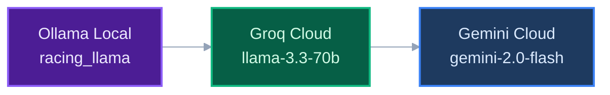
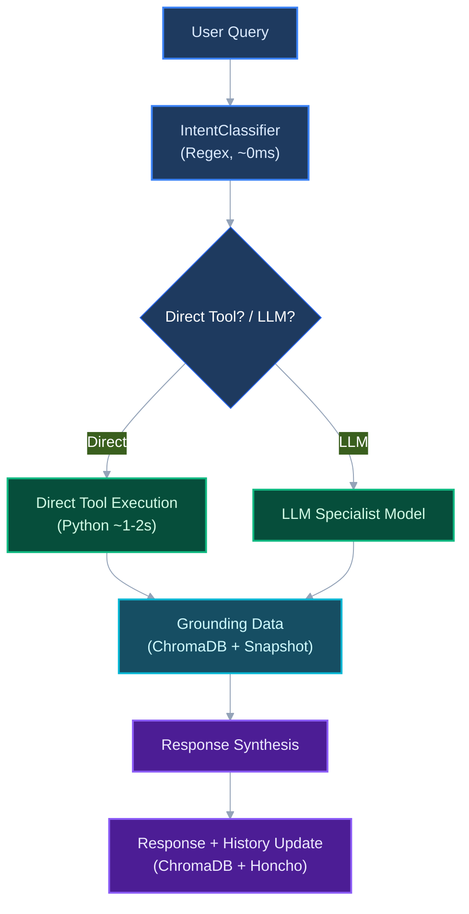

# AGENTS.md - Agent Coding Guidelines

This document provides guidelines for AI agents working in this repository.

---

## Project Overview

**South African Horse Racing Intelligence System — 3-Layer Architecture**

- **Cloudflare MCP Edge** (`cloudflare_mcp_edge/`): Always-free edge worker with 16 MCP tools, OKF knowledge bundle, REST API, D1 + KV
- **Modal Backend** (`core_agent/`): Serverless Python backend for AI analysis, scrapers, Telegram bot
- **Vercel HUD** (`strike-tips-hud/`): Vite + React + Three.js frontend with middleware routing

---

## Build / Lint / Test Commands

### Python Backend (core_agent/)

```bash
# Navigate to core_agent
cd core_agent

# Install dependencies
pip install -r requirements.txt

# Run all tests
pytest

# Run single test file
pytest tests/test_analyzer.py

# Run specific test function
pytest tests/test_analyzer.py::TestRaceAnalyzer::test_edge_calculation -v

# Run with coverage
pytest --cov=core_agent --cov-report=term-missing

# Format code (Black) & Lint
black . && flake8 .
```

### Docker (Recommended)

```bash
# From project root
docker compose up -d

# View logs
docker logs -f strike-bot

# Run tests in container
docker exec -it strike-bot pytest
```

### Cloudflare Worker (cloudflare_mcp_edge/)

```bash
cd cloudflare_mcp_edge

# Build OKF knowledge bundle (markdown → TypeScript)
node scripts/build-knowledge.js

# Deploy worker (runs predeploy → wrangler deploy)
npm run deploy

# Dev server
npm run dev

# Set secrets
npx wrangler secret put BACKEND_API_URL
npx wrangler secret put BACKEND_API_KEY
npx wrangler secret put SEARCH_API_KEY   # optional
```

### Vite Frontend (strike-tips-hud/)

```bash
cd strike-tips-hud

# Development server
npm run dev

# Production build
npm run build

# Deploy to Vercel (preview)
vercel

# Deploy to Vercel (production, fresh build)
vercel deploy --prod -y --force
```

---

## Code Style Guidelines

### Python Backend

#### Imports
Standard library first, then third-party, then local. Use absolute imports.
```python
import os
import json
from dataclasses import dataclass
from typing import List, Optional, Dict

import httpx

from core_agent.config.model_config import ModelConfig
from core_agent.tools.maf_tool_registry import TOOL_REGISTRY
```

#### Formatting
- **Black** for formatting (line length: 88)
- 4 spaces for indentation

#### Types
- Use **dataclasses** for data models
- Use **Enums** for fixed sets
- Use **pydantic** for API validation (in routes)
- Always type hint functions
```python
class BetConfidence(Enum):
    STRONG_VALUE = "STRONG_VALUE"
    VALUE = "VALUE"
    MARGINAL = "MARGINAL"

@dataclass
class Runner:
    horse_name: str
    odds_decimal: float
    jockey: Optional[str] = None
```

#### Naming
- Classes: `PascalCase` (e.g., `RaceAnalyzer`)
- Functions: `snake_case` (e.g., `calculate_edge()`)
- Constants: `UPPER_SNAKE_CASE`
- Files: `snake_case.py`

#### Docker Paths
- Use `/app/` as base path inside containers
- Use `PYTHONPATH=/app` for imports to work

#### Error Handling
- Use custom exceptions for domain errors
- Catch specific exceptions, avoid bare `except:`
- Log errors before re-raising

#### Docstrings
- Google-style docstrings with Args, Returns sections

---

### Cloudflare Worker

- TypeScript for all files (`.ts`)
- `@modelcontextprotocol/sdk` v1.29.0 for MCP server
- `WebStandardStreamableHTTPServerTransport` with `sessionIdGenerator: undefined` (stateless)
- Zod for input validation in MCP tools
- Always include `Accept: application/json, text/event-stream` header for MCP endpoint
- Auth via `x-api-key` header

### Vite Frontend (strike-tips-hud/)

- TypeScript + React 19 + Three.js
- Tailwind CSS v4 for styling
- Framer Motion for animations
- Middleware (`middleware.ts`) routes API calls to Cloudflare or Modal
- `vercel.json` has SPA rewrite only — no API rewrites (middleware handles routing)

---

## Project Structure

```
core_agent/                          # Python backend (refactored April 2026)
├── agents/                          # AI orchestration layer
│   ├── ai_pydantic.py              # ModelPipeline + UnifiedOrchestrator
│   ├── ai_providers.py            # AI provider routing (Groq/Gemini/Ollama)
│   ├── intent_classifier.py       # Regex-based intent detection (~0ms)
│   ├── telegram_agent_loop.py     # Telegram bot loop
│   └── specialists/               # Specialist agents
│       ├── analyst_agent.py
│       ├── scanner_agent.py
│       └── bankroll_agent.py
├── config/                         # Configuration
│   ├── model_config.py            # Centralized model config
│   ├── settings.py                # Bankroll & system settings
│   ├── paths.py                   # Path configuration
│   └── model_factory.py           # Model factory
├── core/                           # Core business logic
│   ├── strike_tips.py             # Main orchestrator
│   ├── strike_brain.py            # Central state manager (singleton)
│   ├── engine.py                  # Execution engine
│   ├── adaptive_odds_monitor.py  # Live odds monitoring
│   └── api.py                     # FastAPI entry point
├── skills/                        # Domain skills
│   ├── race_analysis/            # Race analyzer, form analyzer
│   ├── bankroll_manager/          # Bankroll governor (Kelly criterion)
│   ├── memory/                   # ChromaDB + Honcho memory (dual system)
│   ├── parsers/                  # Tab4, PDF, odds scrapers
│   ├── learning/                  # Learning engine (ROI tracking)
│   └── notifications/            # Telegram notifier
├── tools/                         # MAF Tool Registry
│   └── maf_tool_registry.py      # 15 gambling-free tools (incl. ATR + dreams)
├── routes/                        # FastAPI routes
│   ├── agent.py                  # /api/agent endpoints
│   ├── betting.py                # /api/betting
│   ├── racing.py                  # /api/racing
│   ├── config.py                  # /api/config
│   └── monitoring.py             # /api/monitoring
├── ollama_configs/                # 5 racing Modelfiles
│   ├── racing_llama.Modelfile
│   ├── racing_qwen.Modelfile
│   ├── func_gemma.Modelfile
│   ├── lfm_racing.Modelfile
│   └── ds_racing.Modelfile
├── prompts/                       # System prompts
├── services/                      # Business services
└── requirements.txt

cloudflare_mcp_edge/              # Cloudflare Worker (always-free edge)
├── src/
│   ├── index.ts                  # Worker entry (REST + MCP + OKF, 564 lines)
│   └── generated/
│       └── racing-knowledge.ts   # Auto-generated OKF bundle (34 KB, 12 entries)
├── knowledge/racing/             # OKF markdown source (12 files)
│   ├── index.md
│   ├── conditions/going.md
│   ├── strategies/{kelly-criterion,value-betting}.md
│   └── tracks/{7 tracks}.md
├── scripts/
│   └── build-knowledge.js        # Build script (markdown → TypeScript)
├── package.json                  # @modelcontextprotocol/sdk v1.29.0
└── wrangler.jsonc                # D1 + KV bindings

strike-tips-hud/                  # Vite + React frontend (Vercel)
├── src/
│   ├── app/                      # UI components
│   └── lib/                      # API utilities
├── middleware.ts                 # Routing: Cloudflare vs Modal
├── vercel.json                   # SPA rewrite only
└── package.json
```

---

## 3-Layer Architecture

### Layer Routing

```
User → strike-tips-hud.vercel.app
         │
         ▼ middleware.ts
         │
         ├── Cloudflare endpoints → striketips-mcp.gmphorg379.workers.dev
         │    (/api/health, /api/knowledge/*, /api/racing/*, /mcp, etc.)
         │
         └── Modal endpoints → gmpho--strike-tips-racing-serve-api.modal.run
              (/api/agent, /api/betting, /v1/*, etc.)
```

### Cloudflare Endpoints (13 REST + 16 MCP)

Cloudflare handles all compute-light operations at zero cost:
- 12 knowledge paths (OKF bundle) with search, lookup, list
- 11 original MCP tools + 4 OKF tools + 1 web search tool = 16 total
- D1 database for form insights (244 seeded records)
- KV cache for live odds (odds monitor pushes via POST /api/ingest-snapshot)

### OKF Knowledge Bundle

12 curated markdown files about SA horse racing, compiled to TypeScript at build time:
- 7 tracks with real data (Kenilworth 1881, Durbanville 1922, etc.)
- Going/conditions guide
- Value betting + Kelly Criterion strategies
- Search ranks by keyword match (10× title/tags, 5× body, + per-occurrence)

---

## Key Conventions

1. **Environment Variables**: Use `.env` files, never commit secrets
2. **Docker Paths**: Use `/app/` prefix inside containers
3. **Bankroll Rules**: Never bypass max bet percentage (5%) or loss limits
4. **API Responses**: Always handle errors gracefully
5. **Testing**: Write tests for new features
6. **Type Safety**: Avoid `any` in TypeScript; use type annotations in Python

---

## Model Pipeline Architecture

The system uses a delegation chain for fast AI responses:

### Model Specialties

| Model | Specialty | Speed | Tools |
|-------|-----------|-------|-------|
| `racing_llama` | Router + Synthesizer | Fast | All |
| `racing_qwen` | Fast Reads | ~1-2s | get_account_summary, search_racing_data |
| `func_gemma` | Write Operations | ~1-2s | record_selection, update_race_result |
| `lfm_racing` | Deep Analysis | ~2-3s | evaluate_race, run_daily_analysis |
| `ds_racing` | Reasoning | Variable | calculate_probability_edge |

### Fallback Chain



### Intent Routing Flow



---

## 15 MAF Tools (Gambling-Free Names)

All tools use gambling-free naming to avoid model content filters:

| Tool | Purpose | Specialist |
|------|---------|------------|
| `evaluate_race` | Analyze race for value opportunities | lfm_racing |
| `calculate_probability_edge` | Calculate edge percentage | ds_racing |
| `get_account_summary` | Check balance and profit/loss | racing_qwen |
| `record_selection` | Record a racing selection | func_gemma |
| `update_race_result` | Update selection result | func_gemma |
| `calculate_max_position` | Calculate max safe stake | racing_qwen |
| `search_past_races` | Search historical data | racing_qwen |
| `search_racing_data` | Web search for racing info | racing_llama |
| `verify_race_exists` | Check if race is scheduled | racing_qwen |
| `run_daily_analysis` | Scan all tracks for races | lfm_racing |
| `get_odds_snapshot` | Get current odds (Betway primary) | racing_qwen |
| `get_atr_market_movers` | ATR horses with significant odds movement | racing_qwen |
| `get_atr_predictor` | ATR AI predictions for upcoming races | racing_qwen |
| `get_atr_results` | ATR race results from yesterday | racing_qwen |
| `get_dream_context` | Agent's background reasoning/dreams | racing_qwen |

---

## Docker 3-Container Setup

| Container | Image | Purpose | Port |
|-----------|-------|---------|------|
| `strike-bot` | `strike-tips-base:latest` | FastAPI backend | 8000 |
| `ollama` | `uberchuckie/ollama-intel-gpu` | Local LLM (Intel GPU/WSL2) | 11434 |
| `odds-monitor` | `strike-tips-base:latest` | Playwright scraper | - |

---

## Learning System

The system tracks historical performance to improve predictions:

- **LearningEngine** (`core_agent/skills/learning/engine.py`) - ROI tracking
- **AdaptiveAnalyzer** (`core_agent/skills/learning/analyzer.py`) - Probability adjustment

### Tracked Metrics

- Track performance
- Distance performance
- Odds range performance
- Trainer/Jockey success rate
- Edge threshold performance

---

## Auto-Result Updates

**ResultTracker** (`core_agent/skills/result_tracker.py`) automatically:

1. Searches for race results via DuckDuckGo
2. Scans result URLs via StealthEngine
3. Matches winners to open bets (fuzzy matching)
4. Auto-settles bets (WON/LOST)
5. Sends Telegram notifications

---

## Environment Configuration

### Key Environment Variables (.env)

```env
# Telegram
TELEGRAM_BOT_TOKEN=xxx
TELEGRAM_CHAT_ID=xxx

# AI Models
GROQ_API_KEY=xxx
GEMINI_API_KEY=xxx
OLLAMA_HOST=http://ollama:11434

# Model Assignments (optional overrides)
MODEL_ORCHESTRATOR=local:llama3.2:1b
MODEL_REASONER=ds_racing
MODEL_SCRAPER=racing_qwen
MODEL_FUNC_CALL=func_gemma
MODEL_THINKING=lfm_racing
MODEL_FAST_LOCAL=racing_llama

# ChromaDB Cloud (optional — falls back to local persistent storage)
CHROMA_API_KEY=xxx
CHROMA_HOST=api.trychroma.com
CHROMA_DATABASE=strike_tips26

# Embedding model (local Ollama, with Gemini cloud fallback)
MODEL_EMBEDDER=embeddinggemma:300m
```

---

## Testing Guidelines

### Writing Tests

```python
# In core_agent/tests/test_analyzer.py
import pytest
from core_agent.skills.race_analysis.analyzer import RaceAnalyzer

def test_edge_calculation():
    analyzer = RaceAnalyzer()
    edge = analyzer.calculate_edge(0.30, 0.20)  # 30% vs 20%
    assert edge == 0.10
```

### Running Tests

```bash
# All tests
pytest

# With coverage
pytest --cov=core_agent --cov-report=term-missing

# Specific file
pytest core_agent/tests/test_analyzer.py -v
```

---

## Important Notes

1. **No Pydantic AI**: The system now uses direct `httpx` calls to Ollama instead of Pydantic AI
2. **Docker First**: Always test in Docker before deploying
3. **Centralized Config**: All model config is in `core_agent/config/model_config.py`
4. **ChromaDB Cloud**: Memory uses hosted ChromaDB (api.trychroma.com) with local Ollama embedding (embeddinggemma:300m) and Gemini cloud fallback
5. **Keep Tools Gambling-Free**: Always use tool names like `record_selection` not `place_bet`
6. **Cloudflare Workers Free Tier**: 100k req/day, 10k AI Neurons/day — use for compute-light operations only
7. **OKF Compiles at Build Time**: Run `node scripts/build-knowledge.js` before `wrangler deploy` (auto-runs via `predeploy`)
8. **MCP Stateless Transport**: `WebStandardStreamableHTTPServerTransport` with `sessionIdGenerator: undefined` — fresh transport per request, required for Workers
9. **Middleware Routes API**: `strike-tips-hud/middleware.ts` decides Cloudflare vs Modal per path — Cloudflare for knowledge/odds/form, Modal for AI/analysis
10. **Fresh Vercel Builds**: Use `vercel deploy --prod -y --force` to bypass build cache

---

### 💾 Browser AI Storage & GPU Safeguards
- **Quota Validation**: Call `navigator.storage.estimate()` before downloading weights. Warn if free space is less than 1.5GB for 1B+ models.
- **Storage Persistence**: Call `navigator.storage.persist()` on app boot to secure cached weights against browser cleanup routines.
- **Storage Recovery Trigger**: Expose a clear UI trigger that recursively clears OPFS (`getDirectory().removeEntry(...)`) to purge corrupted model shards when JSON parse errors happen.
- **GPU Loss Fallback UI**: Intercept WebGPU context resets and guide the user to reload the page with a less memory-intensive model.

### 🌐 Web AI Architecture & Framework Rules
- **WebLLM (MLC-AI)**: Use for browser-local LLM chat (Llama, Qwen) where tokens/sec generation throughput and native tool/schema calling is required.
- **Transformers.js (ONNX)**: Use for general embedding generation, Whisper transcription, or CLIP image vector classification.
- **MediaPipe (LiteRT)**: Use for real-time vision analytics (gesture detection, face mesh tracking) and lightweight mobile-web applications.
- **Wasm Multithreading Headers**: Dev/preview servers must send `Cross-Origin-Opener-Policy: same-origin` and `Cross-Origin-Embedder-Policy: require-corp` to prevent thread locking on the client's main thread.


*Last Updated: June 2026*
*Architecture Version: 2.1*
