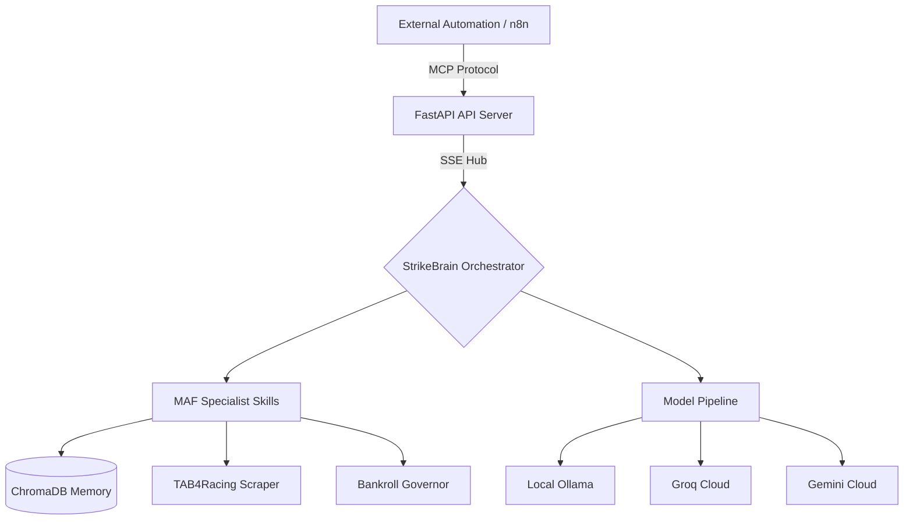

# Strike Tips: Architecture & MCP Integration Guide (v2.0)

> **📅 Last Updated:** April 2026 | **Version:** 2.0

## 🎯 Architecture Overview
Strike Tips uses a **Specialist Agent** pattern where a central `StrikeBrain` orchestrates specialized skills. These skills are exposed as JSON-RPC 2.0 tools via MCP, allowing for standardized, type-safe interaction.

### System Diagram


### Updated Components (April 2026)

| Component | Location | Notes |
|-----------|----------|-------|
| **API Server** | `core_agent/api.py` | FastAPI on port 8000 |
| **MCP Server** | `core_agent/core/mcp_server.py` | JSON-RPC 2.0 |
| **StrikeBrain** | `core_agent/core/strike_brain.py` | Singleton orchestrator |
| **ModelPipeline** | `core_agent/agents/ai_pydantic.py` | No Pydantic AI (direct httpx) |
| **Tools** | `core_agent/tools/maf_tool_registry.py` | 11 gambling-free tools |

## 🛠️ MCP Capability Mapping

| Category | Strike Tips MCP Skill | Use Case |
| :--- | :--- | :--- |
| **Research Tools** | `evaluate_race` / `run_daily_analysis` | Identify value bets and scan race cards. |
| **File Manager** | `search_past_races` (ChromaDB) | Query historical data and betting insights. |
| **Calendar Manager** | `verify_race_exists` / `get_odds_snapshot` | **Calendar Management**: Smart content scheduling for races and market monitoring. |
| **Analytics Tracker** | `get_account_summary` | **Analytics Tracking**: Performance monitoring and insights for P&L and win rates. |
| **Search Tool** | `search_racing_data` | Perform live web searches for race results. |
| **Hashtag Optimizer** | `calculate_probability_edge` | Calculate bet value and risk profile. |

## 🔌 Using MCP Endpoints
The API is hosted at `http://localhost:8000`.

### Core Endpoints
- **SSE (Standard):** `http://localhost:8000/mcp/sse`
- **Tool Discovery:** `http://localhost:8000/mcp/tools`

### Example: Searching Racing Data
**Request:**
```http
POST /mcp/search_racing_data
Content-Type: application/json

{
  "query": "Kenilworth recent results"
}
```

**Response:**
```json
{
  "query": "Kenilworth recent results",
  "results": ["...snippet 1...", "...snippet 2..."],
  "count": 2
}
```

## 🚀 n8n/Automation Workflow Integration

### Workflow Pattern: The Value Scan Pipeline
1.  **Trigger:** `run_daily_analysis` (Scan tracks)
2.  **Research:** `search_racing_data` (Verify track conditions)
3.  **Governance:** `calculate_max_position` (Risk check)
4.  **Execute:** `record_selection` (Place bet)
5.  **Monitor:** `get_account_summary` (Update dashboard)

## 💡 Best Practices
- **Use Mock Mode:** When building workflows, use the stub/mock data patterns provided in the skill implementations to test without risk.
- **Governor Limits:** Always use `calculate_max_position` before calling `record_selection` to respect bankroll governance rules.
- **Batching:** When scanning multiple tracks, use `run_daily_analysis` instead of calling `evaluate_race` for each race individually to optimize latency.

## 🔗 Technical Setup
1. **Host:** `http://localhost:8000`
2. **Auth:** `X-API-KEY` required (see `docs/deployment_security.md`).
3. **Environment:** Access via Docker-Compose container `strike-bot`.

### Updated n8n Integration (v2.0)

```json
{
  "mcpServers": {
    "strike-tips": {
      "command": "npx",
      "args": [
        "@modelcontextprotocol/server-sse",
        "http://localhost:8000/mcp/sse"
      ],
      "env": {
        "X-API-KEY": "your_strike_tips_api_key"
      }
    }
  }
}
```

> **⚠️ Note:** Container name changed from `strike-bot-new` to `strike-bot` in v2.0.

---

## 🔗 Integrating with Claude Desktop

To connect your secured Strike Tips instance to Claude Desktop, follow these steps:

### 1. Locate Configuration
* **macOS**: `~/Library/Application Support/Claude/claude_desktop_config.json`
* **Windows**: `%APPDATA%\Claude\claude_desktop_config.json`

### 2. Add Server Configuration
Update your `claude_desktop_config.json` with the following configuration. Ensure you replace `YOUR_API_KEY_HERE` with your actual `STRIKE_TIPS_API_KEY` from your `.env` file.

```json
{
  "mcpServers": {
    "strike-tips": {
      "command": "curl",
      "args": [
        "-s",
        "-H", "X-API-KEY: YOUR_API_KEY_HERE",
        "http://localhost:8000/mcp/sse"
      ]
    }
  }
}
```

### 3. Usage
1. Restart Claude Desktop.
2. Look for the "plug" icon in the chat interface.
3. You can now use natural language to trigger your tools:
   - *"Check my current bankroll balance."*
   - *"List the value bets found in today's daily scan."*
   - *"Search for Turffontein race results."*

### Troubleshooting
* If the plug icon does not appear, check your container logs with: `docker logs strike-bot`
* Ensure your bot is running (`docker compose up -d`) before opening Claude.

---
*Updated for v2.0 - April 2026*
