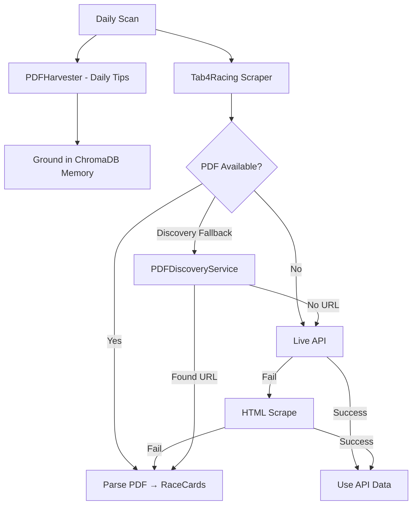

# PDF-First Scraper Implementation Plan

## Objective
Replace brittle HTML scraping with robust PDF field extraction for TAB racing data. The PDF harvester now exists as a fallback (tab4racing) and as the first step in daily scans (strike_tips), but full race card parsing from PDFs is not yet complete.

## Current State (June 2026)

### Implemented
- **PDFHarvester** (`core_agent/skills/parsers/pdf_harvester.py`):
  - Downloads PDFs from TAB's Azure blob CDN (`aztabstorage.blob.core.windows.net`) via `httpx`
  - Extracts text using `fitz` (PyMuPDF)
  - Caches parsed results as JSON in `data/pdf_cache/`
  - `raw_text` capped at 50,000 characters
  - Falls back to dynamic URL discovery (`PDFDiscoveryService`) on 404

- **PDFDiscoveryService** (`core_agent/skills/parsers/pdf_discovery.py`):
  - Discovers live PDF URLs via TAB REST API (`totex-col.4racing.com` — no Playwright needed)
  - Takes track name and date, returns matching PDF URL

- **tab_pdf_mapper** (`core_agent/skills/parsers/tab_pdf_mapper.py`):
  - Maps parsed PDF tips into `RaceCard`/`Runner` domain objects

- **tab4racing.py** (`core_agent/skills/parsers/tab4racing.py`):
  - 3-tier fallback: (1) Live API → (2) HTML scrape → (3) PDF harvester
  - PDF is **last resort**, not primary

- **strike_tips.py** (`core_agent/core/strike_tips.py`):
  - `run_daily_scan` fetches Daily Tips PDF first and grounds them in ChromaDB memory

- **Scratch scripts** (pypdf, for manual inspection only):
  - `core_agent/scratch/test_pdf_inspection.py` — test PDF discovery/download
  - `core_agent/scratch/extract_pdf_text.py` — extract text from any PDF URL

### Not Yet Working
- **PDF parser regex** (`pdf_harvester.py`) looks for `NO- DR` / `HORSE` headers that don't exist in actual PDFs → yields 0 `parsed_tips`
- **tab_pdf_mapper** needs actual runner data to map (currently gets empty lists)
- **tab4racing** PDF fallback hits stub (0 tips) — never returns real data

## Remaining Steps

### 1. Fix PDF Text Parsing (`pdf_harvester.py` → `_parse_pdf_bytes`)
- Inspect actual PDF text output (use `fitz` directly on a real PDF URL from `PDFDiscoveryService`)
- Update regex to match the actual PDF columnar format:
  - Race numbers — likely near page breaks or marked with "Race X" headers
  - Runner names — fixed-width columns with numbers, form figures, jockey, weight, odds
  - Ignore header/footer noise
- Handle multi-page PDFs per track

### 2. Make PDF the Primary Source (`tab4racing.py`)
- Move PDF check **before** HTML scraping (swap priority of step 2 and 3)
- Only fall back to HTML scrape when PDF is unavailable or fails
- Validate PDF output against known race data before relying on it

### 3. Validate End-to-End
- Run: `docker exec -it strike-bot python core_agent/core/strike_tips.py scan`
- Confirm logs show: `[PDF] Processing: <pdf_url>` instead of HTML scrape paths
- Verify `data/pdf_cache/` has fresh entries with non-empty `parsed_tips`
- Compare parsed runner count vs actual race card from TAB website

## Key Files

| File | Role |
|------|------|
| `core_agent/skills/parsers/pdf_harvester.py` | PDF download + text extraction + caching |
| `core_agent/skills/parsers/pdf_discovery.py` | Dynamic PDF URL discovery (httpx REST API) |
| `core_agent/skills/parsers/tab_pdf_mapper.py` | Maps parsed PDF → RaceCard/Runner |
| `core_agent/skills/parsers/tab4racing.py` | Scraper with 3-tier fallback (API → HTML → PDF) |
| `core_agent/core/strike_tips.py` | Daily scan — PDF tips grounded in memory first |
| `data/pdf_cache/` | Cached PDF parse results (JSON) |
| `core_agent/scratch/test_pdf_inspection.py` | Test script for manual PDF inspection (pypdf) |
| `core_agent/scratch/extract_pdf_text.py` | Standalone PDF text extractor (pypdf) |

## Architecture

