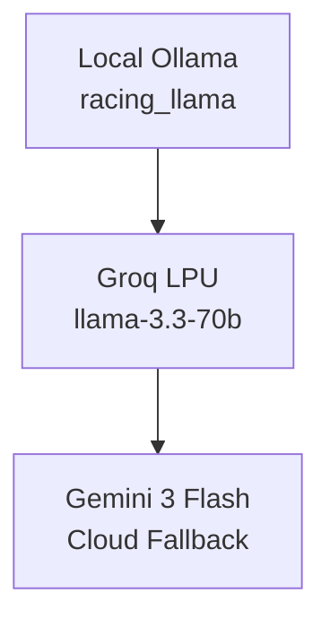
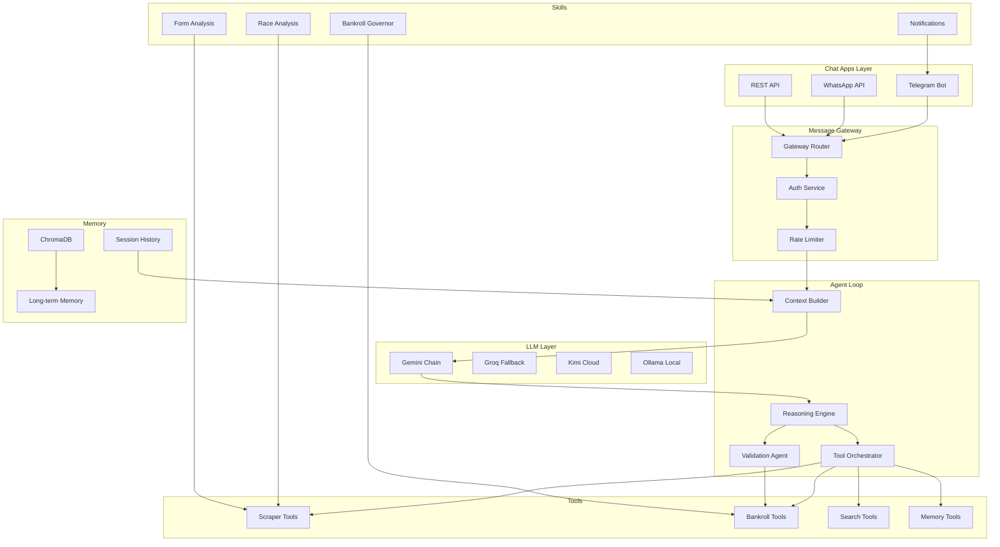

# Strike Tips - L7/L8 AI DevOps Architecture Review (v2.0)

> **📅 Updated:** April 2026 | **Version:** 2.0
> **⚠️ Note:** The codebase has been refactored. Key changes: `strike-tips/` → `core_agent/`, Pydantic AI removed (direct httpx)

> **Architecture Assessment** - March 2026 (Updated April 2026)
> **Reviewer:** L7/L8 Full Stack AI DevOps Engineer

---

## Executive Summary

The Strike Tips system represents a **mature, skill-based modular architecture** that correctly leverages modern LLM orchestrators (Pydantic AI) while maintaining strict deterministic governors for high-risk operations like betting. The system demonstrates **Tier-7 AI resilience** characteristics with its multi-tier model fallback chain.

### Overall Autonomy Score: **7.5/10**

| Category | Score | Notes |
|----------|-------|-------|
| Scraping & Data Ingestion | 8/10 | Self-healing parsers, adaptive selectors |
| AI Reasoning Chain | 9/10 | 7-tier fallback, grounded inference |
| Bankroll Governance | 9/10 | Hard limits, atomic persistence |
| Observability | 8/10 | Prometheus, Loki, OpenTelemetry |
| CI/CD Pipeline | 3/10 | **Missing** - manual deployment |
| Self-Healing (Code) | 4/10 | Advisory only, no auto-patch apply |
| System Vitals | 2/10 | **Missing** - no CPU/memory awareness |

---

## Core Strengths (The "Autonomous" Foundation)

### 1. AI Resilience Chain (v2.0)

The [`core_agent/agents/ai_providers.py`](core_agent/agents/ai_providers.py) implements the fallback chain:



**v2.0 Change:** Removed Pydantic AI dependency, now uses direct `httpx` calls.
```

This ensures the system **never goes blind** during API outages or rate limits.

### 2. Self-Healing Parsers

The [`core_agent/skills/parsers/self_healing.py`](core_agent/skills/parsers/self_healing.py) is a **top-tier feature**:

- Tracks selector success/fail rates per selector
- Ranks selectors by success rate dynamically
- Generates `parser_patch.py` for manual review
- Fallback strategies for each element type

### 3. L7 Grounded Intelligence

Native integration of real-time search ([`core_agent/skills/parsers/duckduckgo.py`](core_agent/skills/parsers/duckduckgo.py)) minimizes hallucinations.

### 4. Observability Native

Standardized `[L7-ACTION]` and `[L7-INTENT]` markers in logs ensure the agent's internal state is transparent and queryable via Loki/Grafana.

---

## Component Architecture

```
┌──────────────────────────────────────────────────────────────────────────────┐
│                         STRIKE TIPS SYSTEM                                   │
├──────────────────────────────────────────────────────────────────────────────┤
│                                                                            │
│  ┌─────────────────────────────────────────────────────────────────────┐   │
│  │                    ORCHESTRATION LAYER                               │   │
│  ├─────────────────────────────────────────────────────────────────────┤   │
│  │  strike_tips.py          # Main coordinator                          │   │
│  │  strike_brain.py         # Singleton Brain (unified access)          │   │
│  │  ai_pydantic.py          # L7Orchestrator (Pydantic AI)              │ e  │
│  │  ai_providers.py         # 7-tier model fallback chain               │   │
│  └─────────────────────────────────────────────────────────────────────┘   │
│                                    │                                         │
│  ┌─────────────┐    ┌─────────────┴────────────┐    ┌─────────────────┐   │
│  │   RACE      │    │       BANKROLL           │    │    NOTIFICATIONS│   │
│  │  ANALYSIS   │    │       GOVERNOR           │    │    (Telegram)   │   │
│  │   SKILL     │    │       SKILL              │    │      SKILL      │   │
│  ├─────────────┤    ├─────────────────────────┤    ├─────────────────┤   │
│  │             │    │                         │    │                 │   │
│  │ • Value     │    │ • Max 5% Rule           │    │ • Daily Tips    │   │
│  │   Engine    │    │ • Loss Limits           │    │ • Bet Alerts    │   │
│  │ • Kelly     │    │ • P&L Tracking          │    │ • Results       │   │
│  │   Staking   │    │ • Kelly Sizing          │    │ • Bankroll      │   │
│  │ • Form      │    │ • Atomic Persistence    │    │   Updates       │   │
│  │   Analysis │    │ • Prometheus Metrics    │    │                 │   │
│  │             │    │                         │    │                 │   │
│  └─────────────┘    └─────────────────────────┘    └─────────────────┘   │
│                                    │                                         │
│  ┌──────────────────────────────────────────────────────────────────────┐   │
│  │                    DATA INGESTION LAYER                               │   │
│  ├──────────────────────────────────────────────────────────────────────┤   │
│  │  mcp_server.py (FastMCP)  →  /mcp/sse + /mcp/messages               │   │
│  │  tab4racing.py             →  Primary SA racing scraper              │   │
│  │  self_healing.py          →  Adaptive selector logic                 │   │
│  │  pdf_harvester.py         →  TAB PDF intelligence                    │   │
│  │  duckduckgo.py            →  Web grounding (real-time search)        │   │
│  └──────────────────────────────────────────────────────────────────────┘   │
│                                    │                                         │
│  ┌──────────────────────────────────────────────────────────────────────┐   │
│  │                    OBSERVABILITY LAYER                               │   │
│  ├──────────────────────────────────────────────────────────────────────┤   │
│  │  Prometheus → /metrics (Pushgateway for CLI)                        │   │
│  │  Loki      → Structured logs with L7 markers                        │   │
│  │  OpenTelemetry → FastAPI instrumentation                            │   │
│  │  Grafana   → Dashboard (referenced in docs/)                       │   │
│  └──────────────────────────────────────────────────────────────────────┘   │
│                                                                            │
└──────────────────────────────────────────────────────────────────────────────┘
```

---

## Detailed Component Analysis

### 1. MCP Server (`mcp_server.py`)

| Aspect | Status | Notes |
|--------|--------|-------|
| Transport | ✅ SSE | Standard endpoints |
| Tools Exposed | ✅ 6 tools | search, bankroll, memory, scan, config |
| Resources | ✅ 1 resource | racing://current-config |
| L7 Standard | ✅ High Reliability | Proper error handling |

**Exposed Tools:**
- `search_racing_info` - DuckDuckGo grounding
- `get_bankroll_status` - Bankroll state
- `query_memory` - ChromaDB RAG
- `run_daily_scan` - Full scan execution
- `get_latest_racing_intelligence` - PDF intelligence
- `place_bet` - Bet recording

### 2. Bankroll Governor (`governor.py`)

**Hard Limits (Enforced):**
```python
HARD_LIMITS = {
    "max_bet_percent": 5.0,      # Never >5% on single bet
    "daily_loss_limit": 20.0,    # Stop after 20% loss
    "max_drawdown": 50.0,        # Stop if down 50% from peak
    "min_edge": 5.0,             # Only bet with 5%+ edge
}
```

**Resilience Features:**
- Atomic file writes with temp + backup
- Automatic state recovery from backup
- Prometheus metrics (BANKROLL_CURRENT, BANKROLL_PEAK, etc.)

### 3. Self-Healing Parser (`self_healing.py`)

| Feature | Implementation |
|---------|---------------|
| Selector Tracking | Per-selector success/fail counts |
| Dynamic Ranking | Sorted by success rate |
| Fallback Strategies | Regex-based text extraction |
| Patch Generation | AI generates `parser_patch.py` |
| **Auto-Apply** | ❌ Advisory only - **Gap** |

### 4. Model Configuration (`model_config.py`)

8-tier model hierarchy with environment-driven configuration:

| Tier | Role | Model | Provider |
|------|------|-------|----------|
| 1 | Primary Orchestrator | llama-3.3-70b-versatile | Groq |
| 2-5 | Cloud Fallback | Gemini chain | Google |
| 6 | Cloud Reasoner | Kimi K2 | Moonshot |
| 7 | Local Reasoner | ds_racing | Ollama |
| 8 | Local Scraper | racing_qwen | Ollama |

### 5. Data Storage Structure

```
data/
├── bankroll_state.json       # Current bankroll state
│   ├── current_bankroll: 857.38 ZAR
│   ├── peak_bankroll: 1000.00 ZAR
│   ├── total_profit_loss: 0.00 ZAR
│   └── last_updated: 2026-03-14T12:07:43
│
├── bankroll_state.json.bak   # Backup state
├── bet_history.json          # All bet records
│   ├── bet_id, timestamp, date
│   ├── track, race_number, horse
│   ├── odds, stake, potential_return
│   ├── status: PENDING | WON | LOST | VOID
│   ├── edge_percent, confidence
│   └── actual_return (after settlement)
│
├── chat_history.json         # Telegram chat history
├── performance_metrics.json  # Model request metrics
│   ├── StateHydration_Scraper
│   ├── BetwayAPI_Scraper
│   └── Ghost_Stealth_Fetch
│
├── market_snapshot_latest.json # Live racing data
├── races.json               # Race definitions
├── task_registry.json        # Scheduled tasks
├── daily_scan_YYYY-MM-DD.json # Historical scan results
│
└── chroma/                  # ChromaDB vector store
    └── chroma.sqlite3       # Long-term memory
```

### MAF Resource Mapping for Data

In MAF, these data files can be exposed as MCP resources:

```python
@mcp.resource("bankroll://current")
def get_bankroll_resource() -> Dict:
    """Current bankroll status."""
    with open("data/bankroll_state.json") as f:
        return json.load(f)

@mcp.resource("bets://history")
def get_bets_resource() -> List[Dict]:
    """Historical bet records."""
    with open("data/bet_history.json") as f:
        return json.load(f)

@mcp.resource("market://snapshot")
def get_market_snapshot() -> Dict:
    """Latest market/racing data."""
    with open("data/market_snapshot_latest.json") as f:
        return json.load(f)

@mcp.resource("memory://search")
def query_chroma_memory(query: str) -> List[Dict]:
    """Query ChromaDB vector store."""
    # Connect to chroma/chroma.sqlite3
    pass
```

---

## DevOps & Autonomy Gaps (Critical)

### 1. Missing CI/CD Pipeline

**Current State:** Manual deployment
**Required:** GitHub Actions with:
- Automated pytest execution
- Coverage reports to Telegram
- Docker build on push to main
- Automated backup triggers

### 2. Manual Patch Application

**Current State:** [`generate_parser_patch()`](core_agent/skills/parsers/self_healing.py) creates patch files but doesn't apply them

**Current State:** [`bankroll_state.json`](data/bankroll_state.json), [`bet_history.json`](data/bet_history.json)
**Risk:** No transactional integrity, potential for corruption under high load
**Recommendation:** Consider SQLite for production

### 4. No System Vitals Tool

**Gap:** Agent can perform tasks but lacks self-awareness

**Missing Tools:**
```python
@mcp.tool()
def check_system_vitals() -> Dict:
    """Report server health: CPU, Memory, Disk, Uptime"""

@mcp.tool()
def check_api_quotas() -> Dict:
    """Alert if Gemini/Groq credits are running low"""
```

---

## Recommended Enhancements for Full-Spectrum Autonomy

### Priority 1: CI/CD Pipeline

```yaml
# .github/workflows/ci.yml
name: Strike Tips CI
on: [push, pull_request]
jobs:
  test:
    runs-on: ubuntu-latest
    steps:
      - uses: actions/checkout@v3
      - name: Run pytest
        run: pytest --cov=strike_tips --cov-report=term
      - name: Upload coverage
        run: coverage-badge -o coverage.svg
```

### Priority 2: Auto-Patching Self-Heal

Move from Advisory → Active Healing:

```python
class AutoHealingScheduler:
    async def check_and_apply_patches(self):
        pending = list(Path("patches/pending").glob("*.py"))
        for patch in pending:
            # Validate patch syntax
            if self._validate_patch(patch):
                # Apply and reload parser
                self._apply_patch(patch)
                # Move to applied/
                patch.rename(f"applied/{patch.name}")
                # Notify via Telegram
                notify_admin(f"Auto-applied: {patch.name}")
```

### Priority 3: System Vitals Toolkit

```python
import psutil
import os

@mcp.tool()
def check_system_vitals() -> Dict:
    return {
        "cpu_percent": psutil.cpu_percent(),
        "memory_percent": psutil.virtual_memory().percent,
        "disk_percent": psutil.disk_usage('/').percent,
        "uptime_seconds": time.time() - psutil.boot_time(),
    }
```

### Priority 4: Advanced Observability (Grafana Dashboard)

Create a "War Room" dashboard:
- Live P&L Tickers (from Loki logs)
- "Brain" Intent Distribution (what is the AI actually doing?)
- Error Heatmaps (where are the scrapers failing?)
- Bankroll trajectory

---

## MAF Integration Readiness

### Current Architecture → MAF Mapping

| Component | MAF Role | Readiness |
|-----------|----------|-----------|
| `scraper.py` | Tool | ✅ Ready - wrap in `@tool` |
| `form_analyzer.py` | Logic Layer | ✅ Ready - call during reasoning |
| `scheduler.py` | Workflow Trigger | ✅ Replace with MAF Workflow |
| `strike_tips.py` | Service Layer | ✅ Keep as "muscles" |
| `ai_providers.py` | Model Connector | 🔄 Custom BaseChatClient needed |
| `data/` | Resources | ✅ Expose via MCP resources |
| `telegram_agent_loop.py` | User Interface | ✅ Replace with MAF ChatAgent + thread |

### OpenCLAW-Inspired Autonomous Agent Architecture

> Drawing from OpenCLAW patterns with security-first design for betting operations



### Security-First Agent Configuration

Following OpenCLAW's sandbox principles, the betting agent uses a **restricted security profile**:

```json
{
  "agents": {
    "list": [
      {
        "id": "racing_assistant",
        "name": "Strike Tips Racing Assistant",
        "workspace": "~/strike-tips-workspace",
        "sandbox": {
          "mode": "all",
          "scope": "session"
        },
        "tools": {
          "allow": [
            "run_daily_scan",
            "get_bankroll_status",
            "query_memory",
            "search_racing_info",
            "place_bet",
            "telegram"
          ],
          "deny": [
            "exec",
            "write",
            "edit",
            "apply_patch",
            "process",
            "browser"
          ]
        }
      }
    ]
  }
}
```

### Message Routing Configuration

```json
{
  "channels": {
    "telegram": {
      "groups": {
        "-1001234567890": {
          "topics": {
            "1": { "agentId": "racing_assistant" },
            "2": { "agentId": "racing_assistant" }
          }
        }
      }
    },
    "whatsapp": {
      "dmPolicy": "allowlist",
      "allowFrom": ["+27711234567"]
    }
  },
  "bindings": [
    { "agentId": "racing_assistant", "match": { "channel": "telegram" } },
    { "agentId": "racing_assistant", "match": { "channel": "whatsapp" } }
  ]
}
```

### Recommended MAF Implementation Path

1. **Toolification**: Register all skills as `@tool` decorated functions
2. **Memory**: Use MAF's `AgentSession` + ChromaDB for long-term
3. **Custom Provider**: Create `GeminiChatClient(BaseChatClient)` 
4. **Workflow**: Define "Betting Lifecycle" as MAF Workflow with safety checks
5. **Multi-turn**: Use `AgentThread` for conversation state
6. **Gateway**: Implement message routing (Telegram/WhatsApp)
7. **Security**: Add sandbox mode for untrusted interactions

---

## Conclusion

The Strike Tips application is **75% autonomous**. It can survive outages and adapt to selector changes, but it is "locked" in its current execution environment. By bridging the CI/CD and self-awareness gaps, we move into **true "God Mode" DevOps** where the system manages its own lifecycle.

### Immediate Action Items

1. **Create GitHub Actions CI/CD pipeline** (High Priority)
2. **Implement auto-patching for self-healing parser** (High Priority)  
3. **Add system vitals MCP tools** (Medium Priority)
4. **Create Grafana "War Room" dashboard** (Medium Priority)
5. **Implement Message Gateway (Telegram + WhatsApp)** (High Priority)
6. **Add security sandbox for betting operations** (High Priority)
7. **Plan MAF integration** (Future/Secure)

### OpenCLAW-Inspired Next Steps

Following the user's request for OpenCLAW patterns, here is the recommended implementation sequence:

| Priority | Component | Description |
|----------|-----------|-------------|
| 1 | Message Gateway | Unified router for Telegram/WhatsApp/REST API |
| 2 | Tool Registry | Standardized skill-to-tool mapping |
| 3 | Context Builder | Workspace + session preparation before agent loop |
| 4 | Security Profiles | Sandbox mode for untrusted interactions |
| 5 | Rate Limiter | Prevent abuse of agent resources |
| 6 | MAF Integration | Replace custom orchestrator with MAF Workflow |

---

*Review Version: 1.1 (OpenCLAW Patterns Added)*
*Last Updated: March 2026*
