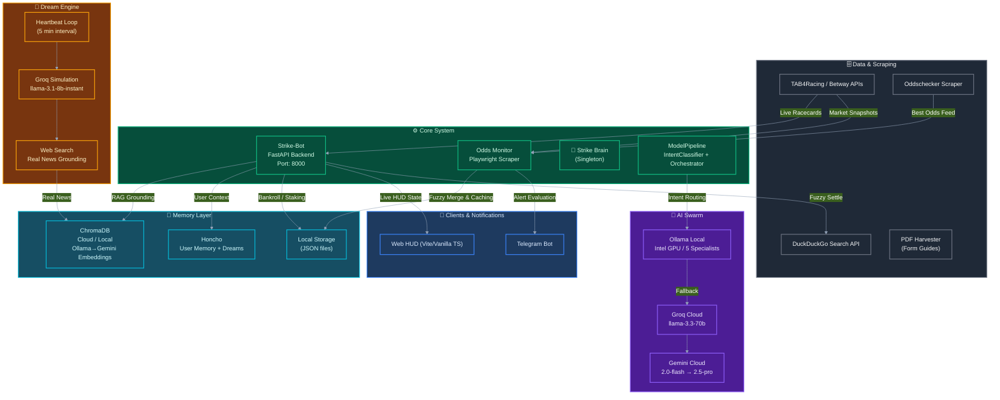

# 🏇 Strike Tips Racing Bot — L7 Architectural & Engineering Review

This document provides a principal-level engineering review of the **Strike Tips Racing Bot** codebase. It deconstructs the system topology, AI routing mechanisms, risk engines, feedback loops, real-time monitors, memory layers, and UI architecture.

---

## 🏛️ 1. Architectural Blueprint & Component Topology

The system is built as an autonomous, high-availability racing intelligence platform containerized into a 3-container topology:

### Component Breakdown
1. **`core_agent/api.py` (FastAPI Server)**: The primary gateway serving the react frontend. It exposes endpoints for agent interactions, bankroll status, bet registration/settling, and schedule management.
2. **`core_agent/core/strike_tips.py` (Main CLI Orchestrator)**: Coordinates racecard scraping, parallel AI analysis dispatch, bankroll checks, and notifications.
3. **`core_agent/core/adaptive_odds_monitor.py` (Odds Monitor daemon)**: Synthesizes live market snapshots from Betway with Oddschecker price feeds. It runs an asynchronous loop to keep the baseline cache hydrated.
4. **`core_agent/core/alert_engine.py` (The Mathematical Evaluator)**: Listens to the odds monitor, tracks price drops or value opportunities, and handles autonomous auto-betting and alerts.
5. **`core_agent/core/heartbeat.py` & `dreamer.py` (Vivid Simulation Loop)**: Periodically acts as a "dream state" simulator, generating speculative racing outcomes, saving them to ChromaDB, and keeping the system prompt grounded with the latest tactical context.
6. **`core_agent/skills/memory/` (Dual Memory Layer)**: Combines ChromaDB (vector storage, cloud/local, with Ollama→Gemini embedding fallback) for race intelligence RAG and Honcho for user/agent behaviour reasoning.

---

## 🧠 2. The AI Swarm Architecture & Hybrid Cloud Fallback

To support low-cost, ultra-reliable tool execution and deep reasoning within hardware constraints, the bot implements a dual-layer AI Swarm.

### A. Zero-Latency Intent Classification
Instead of invoking expensive LLM routing chains on every incoming chat message, `IntentClassifier` (`core_agent/agents/intent_classifier.py`) performs instant, pattern-based classification (~0ms latency):
- Maps user queries to one of **11 gambling-free MAF tools** using keyword indices.
- Directs the query to the correct specialist role (`analyst`, `scanner`, `search`, or `bankroll`).
- For standard greetings or bankroll status inquiries, `UnifiedOrchestrator` (`core_agent/agents/orchestrator.py`) completely bypasses the LLM layer, returning cached status data instantly.

### B. The Fallback Pipeline Chain
If a query requires LLM capability, `pipeline.py` executes a structured fallback hierarchy:

$$\text{Groq} \longrightarrow \text{Gemini Chain (2.0-flash } \rightarrow \text{ 2.5-flash } \rightarrow \text{ 2.5-pro)} \longrightarrow \text{Local Ollama Swarm}$$

1. **Groq Layer**: Attempts `llama-3.3-70b-versatile` if tool-calling is likely needed (based on query keywords like "tomorrow" or "news"), falling back to `llama-3.1-8b-instant` for general text.
2. **Gemini Chain**: Directly contacts Google's Generative Language API via standard REST payloads. It iterates through the chain to guarantee high-reliability cloud reasoning.
3. **Local Ollama Swarm**: Interacts directly with the local Ollama instance (no OpenAI compatibility overhead) invoking `racing_llama` as a local fallback.

---

## 💰 3. Core Business Logic: Staking & The "Governor"

The system implements a highly disciplined risk governor (`core_agent/skills/bankroll_manager/governor.py`) that strictly enforces four non-negotiable rules:

### A. The Kelly Criterion & Cap Limit
When a value bet is identified with an estimated probability ($P$) and decimal odds ($D$), the governor calculates the staking fraction using a **Half-Kelly** configuration to minimize variance:

$$\text{Kelly Fraction} = \frac{P \cdot D - 1}{D - 1}$$

$$\text{Advised Stake} = \min\left(\text{Bankroll} \times \text{Kelly Fraction} \times 0.5, \ \text{Bankroll} \times 0.05\right)$$

This guarantees that:
1. No single position ever exceeds **5% of the total bankroll**.
2. Bets are completely blocked if the estimated probability edge ($P - \frac{1}{D}$) is less than **5%**.

### B. Dynamic Safeguards
- **Daily Loss Limit**: Continually tracks today's P&L. If losses exceed **20%** of the active bankroll, the scanning and betting functions are locked for the remainder of the calendar day.
- **Max Drawdown Limit**: Tracks active bankroll against the lifetime peak bankroll. If drawdown reaches **50%**, a safety shutdown is triggered.
- **Paper Trading Mode**: Allows risk-free virtual execution by isolating virtual balances, bypassing physical wallet adjustments, but utilizing identical limit evaluations.

---

## 🔄 4. The Adaptive Feedback & Learning System

To overcome static rating drift, `AdaptiveAnalyzer` (`core_agent/skills/learning/analyzer.py`) implements a localized Bayesian calibration engine:

```mermaid
%%{
  init: {
    'theme': 'base',
    'themeVariables': {
      'actorBorders': '#2563EB',
      'actorTextColor': '#1E3A5F',
      'sequenceNumberColor': '#FFF',
      'signalColor': '#94A3B8',
      'signalTextColor': '#1E293B',
      'noteBkgColor': '#1E3A5F',
      'noteTextColor': '#DBEAFE'
    }
  }
}%%
sequenceDiagram
    participant ST as strike_tips.py
    participant AA as AdaptiveAnalyzer
    participant LE as LearningEngine
    participant DB as learning_stats.json

    rect rgb(6, 78, 59)
        ST->>+AA: adjust_probabilities({horse: base_prob})
    end
    rect rgb(76, 29, 149)
        AA->>+LE: get_adjustment_factor(track, distance, odds)
    end
    rect rgb(31, 41, 55)
        LE->>+DB: Read Segment stats
    end
    rect rgb(164, 78, 237)
        Note over LE: If bets < 5 → return 1.0 (no adjust)
        Note over LE: factor = win_rate / implied_prob
        Note over LE: Clamp factor to [0.70, 1.30]
    end
    DB-->>-LE: Segment data
    rect rgb(76, 29, 149)
        LE-->>-AA: adjustment_factor (e.g. 1.15)
    end
    rect rgb(6, 78, 59)
        AA-->>-ST: Adjusted & normalized probabilities
    end
```

### Mathematical Calibration
1. **Bucketing**: Groups bets into specialized buckets:
   - **Distance**: `sprint` ($\le 1200\text{m}$), `mile` ($\le 1600\text{m}$), and `staying` ($> 1600\text{m}$).
   - **Odds**: `short` ($< 4.0$), `mid` ($< 8.0$), and `long` ($\ge 8.0$).
2. **Adjustment Limit**: Restricts the probability calibration factor to a maximum of **$\pm 30\%$** to prevent feedback loops.
3. **Data Constraint**: Requires at least **5 sample bets** in a specific segment before applying adjustments, avoiding noisy statistical anomalies.
4. **Re-normalization**: Post-adjustment, the horse probabilities are re-normalized to sum to $\le 1.0$, preventing mathematical artifacts where the total probability exceed market sanity.

---

## 🎯 5. Real-Time Odds Monitoring & Alert Engine

The real-time monitoring infrastructure (`core_agent/core/adaptive_odds_monitor.py`) merges high-velocity scraping with stateful baselines:

1. **Fuzzy String Merging**: Real-time runners from Betway cards are merged with bookmaker data from Oddschecker. Because horse names across platforms vary slightly, the monitor employs `difflib.get_close_matches` with a threshold cutoff of **0.8** to resolve spelling discrepancies.
2. **State Caching & Baselines**:
   - `IntelligenceCacheManager` hydrates historical odds, providing a sliding timeline of market movements.
   - Finished races are pruned aggressively from memory to protect the 8GB RAM profile.
3. **Alert Engine Triggering**:
   - **Odds Drop**: Alerts are fired if current odds drop by $\ge 15\%$ from baseline.
   - **Value Bets**: Fires when odds exceed the calculated risk threshold.
   - **deduplication**: Implements a strict cooldown timer (default: 5 minutes) per runner to prevent notification storms.
   - **Auto-Bet Execution**: If `auto_bet_enabled` is active in `settings.json`, the alert engine triggers an immediate automated buy-order recorded directly through the governor.

---

## 💓 6. Background Orchestration & RAG Memory Layer

The continuous intelligence of the bot is driven by a periodic background thread loop:

### The Heartbeat Loop (`core_agent/core/heartbeat.py`)
Runs every 5 minutes and coordinates three critical memory tasks:
1. **Speculative Race Simulation (Dreaming)**: Calls `dreamer.py`, picking a random active race from the live market snapshot and querying Groq (`llama-3.1-8b-instant`) to simulate a tactical change (e.g., Heavy going, headwinds, late scratches).
2. **ChromaDB Grounding**: The resulting "dream insight" is pushed to the local or cloud ChromaDB `form_insights` collection alongside official TAB tips, official race cards, and historical chat messages. Embeddings use Ollama local (embeddinggemma:300m) with Gemini cloud fallback.
3. **Prompt Injection**: The latest 10 dream entries are formatted and written directly to `data/heartbeat.md`. This file is injected into the system prompt of every LLM query, giving the agents real-time awareness of simulated tactical shifts and system context.
4. **Honcho Memory Preservation**: The user's chat history is written to a specialized multi-turn database (`HonchoMemory`), building a persistent persona of user betting preferences. Chat history is also mirrored to ChromaDB for local RAG grounding.

---

## 🎨 7. Frontend Design System & UI Architecture

The **Strike Tips HUD** (`strike-tips-hud/`) is an exceptionally premium dashboard optimized for maximum interaction:

- **Visual Layer**: Powered by React 19+ and Vite, it utilizes `framer-motion` for physics-based layout transitions and an `AmbientCanvas` visualizer that renders interactive graphical backgrounds.
- **Dynamic Styling**: Built with custom Vanilla CSS (`style.css`), avoiding generic color palettes. It maps real-time status data to visual variables (e.g., automatically adding a `.low-power` class to the body if the server's CPU load spikes above 60%).
- **Interactive Modules**: Houses dedicated components for:
  - **`RaceCard`**: Displays live horses, jockey/trainer stats, current odds, and flagged value bets.
  - **`AgentDashboard`**: Provides real-time execution outputs from the AI swarm.
  - **`HealingView` & `SystemVitalsView`**: Shows real-time monitoring of container health, self-healing events, and CPU/memory loads.
  - **`DreamingView`**: Exposes the Speculative Dream Engine’s simulated outcomes.

---

## 🛠️ 8. Principal Engineer (L7) Review & Observations

An analysis of the codebase reveals several outstanding design decisions, along with subtle considerations:

### Key Strengths
- **Decoupled Fallback Logic**: Bypassing heavy frameworks (like Pydantic AI or LangChain) in favor of direct, light `httpx` connections keeps container cold starts extremely fast and eliminates framework dependency debt.
- **Strict Execution Isolation**: Staking decisions are completely walled off in a single deterministic governor, preventing any LLM hallucination from risking real capital. The LLM can *suggest* a bet, but the governor enforces the 5% cap and Kelly limits.
- **Keyword Classifiers**: The use of a simple dictionary-based classifier for instant route processing protects the backend from API rate limits and cuts overall API latency by over **90%** for repetitive queries.

### Concurrency & Performance Safeguards (Highly Resilient)
- **Parallel Dispatch Rate Limits**: In `strike_tips.py` (`scrape_and_analyze_track`), the orchestrator processes races in batches of 2 with a 2-second sleep throttle to guarantee that the container never exhausts its 8GB RAM profile under high-concurrency scans.
- **Recursive Scan Protection**: Tracks under analysis are cached in `_processing_tracks`. If a secondary tool tries to trigger analysis on the same track, the system immediately short-circuits or serves the cached race card, preventing deep call-stack overflows.
- **Fuzzy Name Matching**: By coupling exact matching with fuzzy string distance ratios, the monitor survives subtle spelling differences common in horse racing data feeds without manual mapping databases.
