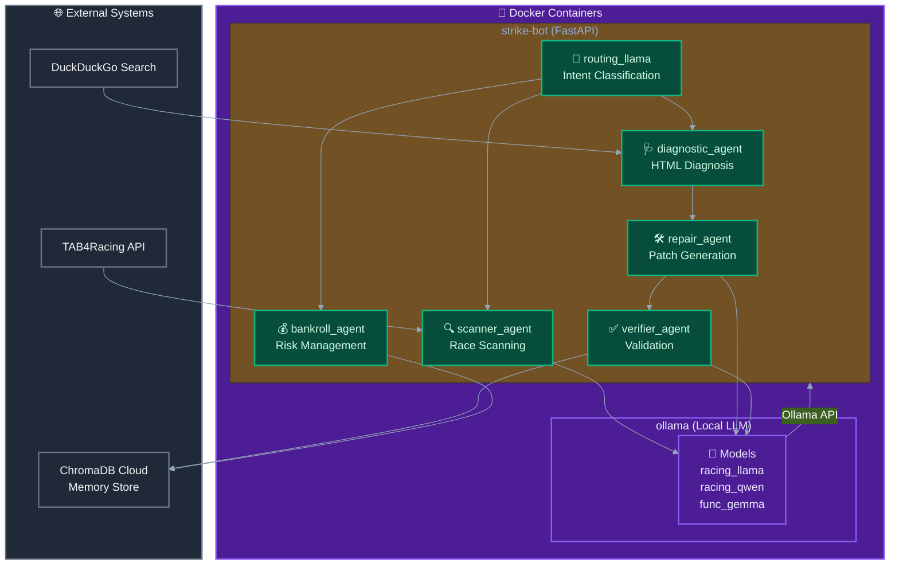
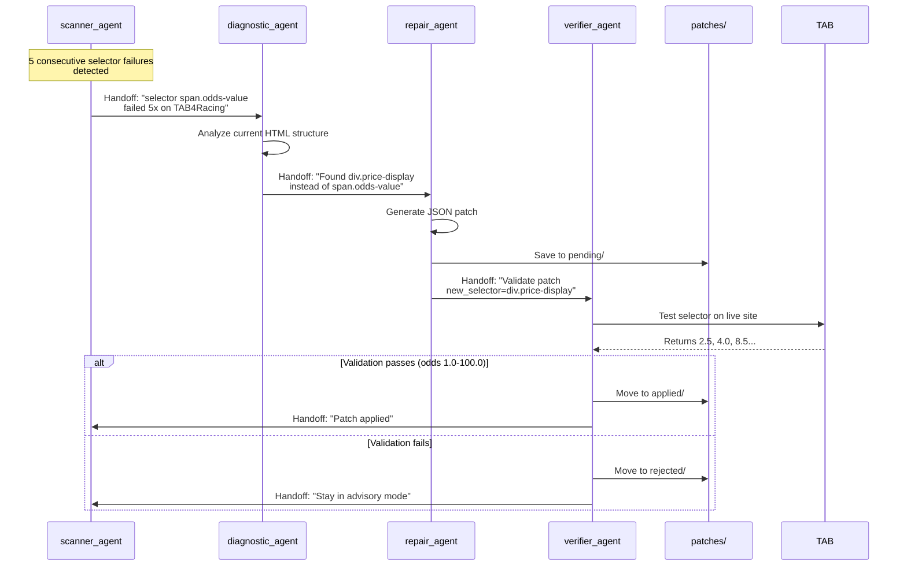

# Healing Cloud Swarm Architecture (v2.0)

> **📅 Updated:** April 2026 | **Version:** 2.0
> **⚠️ Note:** This document references the old `strike-tips/` structure. For v2.0, use `core_agent/`.

## Overview

Multi-agent swarm architecture using **Ollama-hosted local models** for autonomous self-healing scrapers. Inspired by OpenAI Agents SDK handoffs pattern and Mastra agent networks.

## Architecture Diagram (v2.0)



> **v2.0 Change:** Models now run in `ollama` container instead of directly on host.
        TG[Telegram Bot]
        PATCH[patches/pending<br/>patches/applied]
    end
    
    %% Main Flow
    R -->|handoff| S1
    R -->|handoff| S2
    R -->|handoff| S3
    R -->|handoff| S4
    R -->|handoff| S5
    
    S1 -->|detects failure| S2
    S2 -->|generates patch| S3
    S3 -->|validates| S4
    S4 -->|approves| PATCH
    
    S1 -.->|scrapes| TAB
    S5 -.->|notifies| TG
    
    S1 -.-> M
    S2 -.-> M
    S3 -.-> M
    S4 -.-> M
    M -.-> R
    
    style R fill:#1a1a2e,stroke:#0f0,color:#fff
    style S1 fill:#16213e,stroke:#0ff,color:#fff
    style S2 fill:#16213e,stroke:#0ff,color:#fff
    style S3 fill:#16213e,stroke:#0ff,color:#fff
    style S4 fill:#16213e,stroke:#0ff,color:#fff
    style S5 fill:#16213e,stroke:#0ff,color:#fff
    style M fill:#0f3460,stroke:#f09,color:#fff
```

## Agent Specifications

| Agent | Model | Role | Handoffs To |
|-------|-------|------|-------------|
| `routing_llama` | racing_llama | Intent classification, routing | scanner, diagnostic, repair, bankroll |
| `scanner_agent` | racing_qwen | Daily race scanning, data collection | diagnostic |
| `diagnostic_agent` | lfm_racing | HTML structure analysis, failure diagnosis | repair |
| `repair_agent` | func_gamma | Patch generation (JSON) | verifier |
| `verifier_agent` | racing_qwen | Validate patches against live data | scanner, routing |
| `bankroll_agent` | racing_qwen | Risk checks before applying patches | - |

## Detect-Diagnose-Repair-Verify Flow



## Handoff Pattern (Inspired by OpenAI Agents SDK)

```python
from agents import Agent, Runner

# Define specialist agents
scanner_agent = Agent(
    name="Scanner Agent",
    model="racing_qwen",
    handoff_description="Scans racing sites for daily racecards",
    instructions="You scan TAB4Racing for race data. If selectors fail, handoff to diagnostic_agent.",
    handoffs=[diagnostic_agent, routing_agent]
)

diagnostic_agent = Agent(
    name="Diagnostic Agent",
    model="lfm_racing",
    handoff_description="Analyzes HTML structure to find broken selectors",
    instructions="Analyze HTML changes and identify new selectors. Handoff to repair_agent.",
    handoffs=[repair_agent, scanner_agent]
)

repair_agent = Agent(
    name="Repair Agent",
    model="func_gemma",
    handoff_description="Generates JSON patches for broken selectors",
    instructions="Generate JSON patch files. Handoff to verifier_agent.",
    handoffs=[verifier_agent]
)

verifier_agent = Agent(
    name="Verifier Agent",
    model="racing_qwen",
    handoff_description="Validates patches against live data",
    instructions="Test patch on live site. If valid odds (1.0-100.0), apply. Else reject.",
    handoffs=[scanner_agent, routing_agent]
)

# Router agent
routing_agent = Agent(
    name="Routing Agent",
    model="racing_llama",
    instructions="Route user requests and system events to appropriate specialist.",
    handoffs=[scanner_agent, diagnostic_agent, repair_agent, verifier_agent, bankroll_agent]
)
```

## Ollama Integration

```python
import ollama

class OllamaAgent:
    """Wrapper for Ollama models to work with agent patterns"""
    
    def __init__(self, model_name: str, system_prompt: str):
        self.model = model_name
        self.system_prompt = system_prompt
        self.conversation_history = []
    
    def chat(self, message: str) -> str:
        """Send message and get response"""
        response = ollama.chat(
            model=self.model,
            messages=[
                {"role": "system", "content": self.system_prompt},
                *self.conversation_history,
                {"role": "user", "content": message}
            ]
        )
        return response["message"]["content"]
    
    def handoff(self, target_agent: "OllamaAgent", context: str) -> str:
        """Hand off to another agent with context"""
        summary = f"[Handoff from {self.model}] {context}"
        return target_agent.chat(summary)
    
    def update_history(self, role: str, content: str):
        """Update conversation history for memory"""
        self.conversation_history.append({"role": role, "content": content})
```

## Patch Validation Rules

| Element | Validation | Example |
|---------|-------------|---------|
| `odds` | 1.0 <= value <= 100.0 | `2.5`, `15.0` |
| `horse_name` | 2-4 capitalized words | `"King's Champion"` |
| `jockey` | Non-empty string | `"Piere Strydom"` |
| `distance` | Numeric + "m" | `"1200m"`, `"1800m"` |
| `race_time` | HH:MM format | `"14:30"`, `"16:00"` |

## Directory Structure (v2.0)

```
core_agent/
├── patches/                  # Future: Hot patch storage
│   ├── pending/              # Awaiting validation
│   ├── applied/              # Validated and active
│   └── rejected/             # Failed validation
├── ollama_configs/           # Custom model files
│   ├── racing_llama.Modelfile
│   ├── racing_qwen.Modelfile
│   ├── func_gemma.Modelfile
│   └── lfm_racing.Modelfile
├── skills/
│   ├── healing_swarm/     # Multi-agent healing system
│   │   ├── router.py
│   │   ├── scanner_agent.py
│   │   ├── diagnostic_agent.py
│   │   ├── repair_agent.py
│   │   ├── verifier_agent.py
│   │   └── orchestrator.py
│   └── parsers/
│       └── self_healing.py
```

## Key Benefits

1. **Sovereignty**: All models run locally on Ollama - no cloud dependencies
2. **Resilience**: If one agent fails, routing_llama reassigns to another
3. **Modularity**: Each agent has single responsibility (scan → diagnose → repair → verify)
4. **Validation**: Patches only applied if they pass validation checks
5. **Memory**: ChromaDB maintains conversation history across handoffs

## Comparison with Cloud Alternatives

| Feature | Ollama Swarm | Cloud (OpenAI) |
|---------|--------------|----------------|
| Privacy | ✅ All local | ❌ Data leaves |
| Cost | ✅ Free (GPU only) | ❌ Per-token |
| Latency | ✅ Local network | ❌ Internet |
| Customization | ✅ Fine-tune own models | ❌ Limited |
| Offline | ✅ Works without internet | ❌ Requires connection |