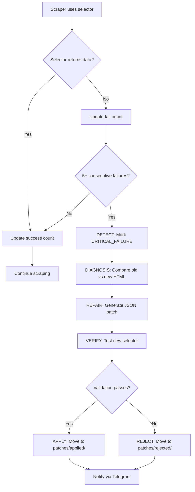

# HotPatchManager Architecture Plan (v2.0)

> **📅 Updated:** April 2026 | **Version:** 2.0
> **⚠️ Note:** Project refactored to `core_agent/`. This is a future plan - not yet implemented.

## Overview

Transform the existing **Advisory Self-Healing** (bot tells you what's wrong) into **Active Self-Healing** (bot fixes itself automatically).

## Current State

The existing [`core_agent/skills/parsers/self_healing.py`](core_agent/skills/parsers/self_healing.py) provides:
- Selector success/failure tracking
- Fallback strategies
- `generate_parser_patch()` - generates patch code but doesn't apply it

## Target Architecture (v2.0)

### 1. Patch Directory Structure

```
core_agent/
├── skills/parsers/
│   ├── self_healing.py         # UPDATED - Existing parser
│   └── hot_patch_manager.py    # NEW - HotPatchManager
├── patches/
│   ├── pending/                # AI-generated patches awaiting validation
│   ├── applied/                # Validated patches ready for hot-loading
│   └── rejected/               # Patches that failed validation
```

### 2. Patch JSON Format

```json
{
  "patch_id": "patch_20260418_143000",
  "target": "tab4racing.py",
  "element": "horse_odds",
  "old_selector": "span.odds-value",
  "new_selector": "div.price-display",
  "confidence": 0.98,
  "created_at": "2026-04-18T14:30:00Z",
  "validated": false,
  "applied": false,
  "validation_errors": []
}
```

### 3. HotPatchManager Class

**Location**: `core_agent/skills/parsers/hot_patch_manager.py`

```python
class HotPatchManager:
    """Manages active self-healing patches for scrapers"""
    
    def __init__(self, patches_dir: str = "./patches"):
        self.patches_dir = patches_dir
        self.pending_dir = os.path.join(patches_dir, "pending")
        self.applied_dir = os.path.join(patches_dir, "applied")
        self.rejected_dir = os.path.join(patches_dir, "rejected")
        self._ensure_directories()
    
    # === Core Methods ===
    
    def load_pending_patches(self) -> List[Patch]:
        """Load all pending patches from patches/pending/"""
    
    def validate_patch(self, patch: Patch, html: str) -> ValidationResult:
        """Validate patch by testing new selector against live HTML"""
        # 1. Test new_selector on current HTML
        # 2. Check if returned data matches expected format
        #    - odds: 1.0 <= value <= 100.0
        #    - horse_name: capitalized words
        #    - jockey: text pattern
        # 3. Return validation result
    
    def apply_patch(self, patch: Patch) -> bool:
        """Move validated patch to patches/applied/"""
    
    def get_applied_patches(self) -> List[Patch]:
        """Get all applied patches for priority loading"""
    
    # === Integration Hooks ===
    
    def get_priority_selector(self, element_type: str, scraper_name: str) -> Optional[str]:
        """Get patched selector if available, else None (use default)"""
    
    # === Detect-Diagnose-Repair-Verify Loop ===
    
    def detect_failure(self, selector_name: str, fail_count: int) -> bool:
        """Detect if selector has failed 5+ consecutive times"""
    
    def create_patch(self, failed_selector: str, new_selector: str, 
                     confidence: float) -> Patch:
        """Create a new patch file in pending/"""
    
    def verify_and_apply(self, patch: Patch, html: str) -> bool:
        """Run validation, apply if passes, reject if fails"""
```

### 4. Integration with SelfHealingParser

Modify [`core_agent/skills/parsers/self_healing.py`](core_agent/skills/parsers/self_healing.py) to add:

```python
class SelfHealingParser:
    def __init__(self, ...):
        ...
        self.hot_patch_manager = HotPatchManager()
        self.consecutive_failures = {}  # Track consecutive failures
    
    def find_element(self, soup, element_type, context=None):
        # NEW: Check for hot patches first
        patched_selector = self.hot_patch_manager.get_priority_selector(
            element_type, scraper_name="tab4racing"
        )
        if patched_selector:
            # Try patched selector first
            ...
        
        # EXISTING: Fall back to default selectors
        ...
        
        # NEW: Track failures for Detect phase
        self._track_failure(element_type)
    
    def _track_failure(self, element_type: str):
        """Track consecutive failures for detection"""
        self.consecutive_failures[element_type] = \
            self.consecutive_failures.get(element_type, 0) + 1
        
        if self.consecutive_failures[element_type] >= 5:
            # Trigger diagnosis
            self._trigger_diagnosis(element_type)
    
    def _trigger_diagnosis(self, element_type: str):
        """Trigger AI diagnosis when 5 consecutive failures detected"""
        # This would call the MAF agent to analyze HTML changes
        pass
```

### 5. Detect-Diagnose-Repair-Verify Flow



### 6. Validation Rules

| Element Type | Validation Rule |
|--------------|-----------------|
| `odds` | Decimal value between 1.0 and 100.0 |
| `horse_name` | 2-4 capitalized words, 5-40 chars |
| `jockey` | Text pattern, not empty |
| `trainer` | Text pattern, not empty |
| `distance` | Numeric + "m" suffix (e.g., "1200m") |
| `race_time` | Time pattern (HH:MM) |

### 7. Error Handling

- **Validation Failure**: Move to `rejected/`, notify via Telegram, stay in Advisory mode
- **Patch Application Failure**: Log error, continue with default selectors
- **No Network**: Queue patch for later validation

### 8. API Endpoints (Optional)

```python
# GET /api/patches/pending - List pending patches
# GET /api/patches/applied - List applied patches  
# POST /api/patches/validate - Validate a patch
# DELETE /api/patches/{id}/reject - Reject a patch
```

## Implementation Steps

1. Create patch directory structure
2. Implement `HotPatchManager` class
3. Add integration hooks to `SelfHealingParser`
4. Add failure tracking (consecutive failures)
5. Add Telegram notification for patch events
6. Test the full Detect-Diagnose-Repair-Verify loop

## Files to Create/Modify

| File | Action |
|------|--------|
| `core_agent/patches/.gitkeep` | Create |
| `core_agent/skills/parsers/hot_patch_manager.py` | Create |
| `core_agent/skills/parsers/self_healing.py` | Modify |
| `core_agent/skills/notifications/telegram_bot.py` | Modify (add patch notifications) |

## Summary

This implementation transforms the system from **Advisory** (bot tells you what's broken) to **Active** (bot fixes itself). The key is the validation step that ensures patches only go live if they produce valid data, preventing the bot from making things worse.

---

## Implementation Reference

### 1. Where to Add HotPatchManager in [`core_agent/skills/parsers/self_healing.py`](core_agent/skills/parsers/self_healing.py)

### 2. Your Scraper: [`core_agent/skills/parsers/tab4racing.py`](core_agent/skills/parsers/tab4racing.py)

### 3. Telegram Notifications: [`core_agent/skills/notifications/telegram_bot.py`](core_agent/skills/notifications/telegram_bot.py)

### 4. Project Root

`core_agent/patches/`
├── pending/   # AI-generated patches
├── applied/   # Validated patches
└── rejected/  # Failed validations
```
