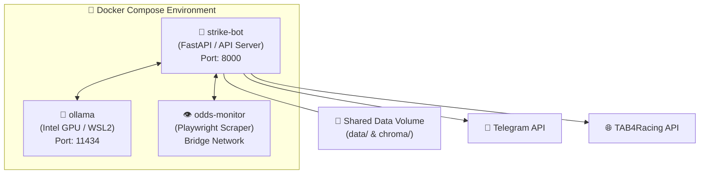
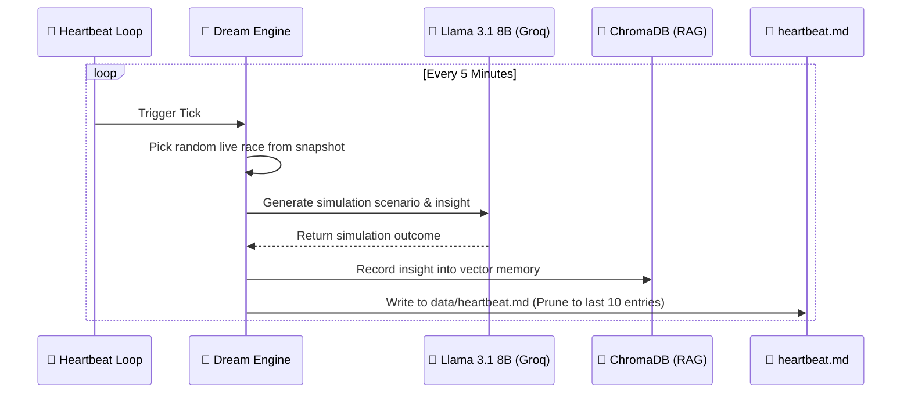

# 🏇 Kimi Agent Strike Tips Racing Bot - Intelligence & Architecture Report

This document details the **Strike Tips** codebase: a state-of-the-art, AI-powered betting intelligence platform specifically designed for South African horse racing. The system implements a modular, skill-based agent architecture, enforces strict bankroll governance, uses decoupled hybrid memory storage, and presents a visual Web HUD using modern React.

---

## 🏛️ System Topology & Container Architecture

Strike Tips is designed as a **3-container Docker ecosystem** that ensures absolute stability, fast builds, and high resource efficiency, optimized to run on modest consumer hardware (e.g., 8GB RAM).



### Container Details & Resource Allocation
 
 | Container | Image/Service | Ports | Purpose | Resource Allocations |
 | :--- | :--- | :--- | :--- | :--- |
 | **`strike-bot`** | Python 3.9 / FastAPI | `8000:8000` | Main backend API, task scheduling, agent execution, bankroll gating. | `CPU: 1.0` \| `RAM: 2.0GB` |
 | **`ollama`** | Ollama local runner | `11434:11434` | Manages and serves local specialized LLMs under GPU acceleration. | `CPU: 1.5` \| `RAM: 2.5GB` |
 | **`odds-monitor`** | Playwright Node | *Internal* | Real-time stealth Playwright scraper pulling live odds from bookmakers + ATR data (Market Movers, Predictor, Results). | `CPU: 0.8` \| `RAM: 1.5GB` |

---

## ⚡ Central AI & Routing Layer

The intelligence layer is decoupled from dependencies like Pydantic AI, using direct REST/hhtpx client calls to Ollama, Groq, and Gemini. It features a high-performance **regex-based routing system** that routes user requests in **~0ms** without wasting LLM reasoning cycles.

### 🔀 Unified Orchestrator & Specialist Swarm

Requests are classified by the `IntentClassifier` using predefined keywords mapping to **15 gambling-free tool intents** (updated June 2026), then assigned to one of the resident specialists:

```
User Prompt ──> IntentClassifier (~0ms)
                    │
                    ├──> analyst ──> evaluate_race / calculate_probability_edge
                    ├──> scanner ──> run_daily_analysis / get_odds_snapshot / get_atr_market_movers / get_atr_predictor / get_atr_results
                    ├──> bankroll ─> record_selection / update_race_result / get_account_summary / calculate_max_position
                    └──> search ───> search_racing_data / search_past_races / verify_race_exists / get_dream_context
```

### ⬇️ LLM Fallback & Parallel Chain

To guarantee robust operations even during hardware constraints or cloud API limits, Strike Tips implements a multi-tier fallback chain:

```
Groq Cloud (llama-3.3-70b)
   │
   └── [Fail / 429] ──> Gemini Cloud (2.0-flash ➔ 2.5-flash ➔ 2.5-pro)
                           │
                           └── [Fail / Offline] ──> Ollama Local (racing_llama ➔ racing_qwen)
```

> [!NOTE]
> **Parallel Scanning Swarm:** During daily track analysis, the system uses parallel dispatch batches of 2 races at a time via `gemini-2.0-flash` (with a 2-second sleep throttle) to protect the host's 8GB RAM from spikes.

---

## 🧩 Domain Skills (The Core Engine)

Strike Tips leverages self-contained, modular **Skills** placed under `core_agent/skills/`.

### 1. Staking Discipline (The "Governor")
Staked bets are strictly audited by `skills/bankroll_manager/governor.py`, enforcing hard limits that **cannot be overridden** by the agent layer:
- **Max Stake Cap:** Never stakes more than **5% of total bankroll** on a single wager.
- **Half-Kelly:** Uses a conservative **0.5 fraction** for staking.
- **Daily Loss Threshold:** Automatically triggers a betting freeze if **20% of bankroll** is lost in a single day.
- **Drawdown Limit:** Stops all operations if drawdown exceeds **50% of peak bankroll**.
- **Value Betting Rule:** A bet is only eligible if the estimated win probability exceeds the implied market probability by **at least 5%** (`Estimated - Implied > 5%`).

### 2. Adaptive Learning Engine
The system adapts dynamically using Bayesian reinforcement principles via `skills/learning/engine.py`:
- **Segment Grouping:** Groups historical performance by `track:distance_bucket:odds_bucket` (Short, Mid, Long odds; Sprint, Mile, Staying distances).
- **Minimum Samples:** Requires **at least 5 bets** in a specific segment before applying adjustments.
- **Capped Adjustment:** Base probability estimates are scaled by the actual-to-implied ratio, capped at **±30% maximum** to prevent extreme variances.
- **Cross-Wire Settle:** Settling wagers immediately feeds actual ROI metrics back to the learning engine.

### 3. Autonomic Racing Scheduler
The schedule service (`skills/race_schedule.py`) dynamically discovers daily events:
- **Dynamic Track Discovery:** Integrates with the TAB4Racing API to fetch schedules.
- **SA Core:** Always guarantees tracking for the **7 core South African racetracks**:
  - *Turffontein, Vaal, Fairview, Scottsville, Kenilworth, Greyville, Durbanville*.
- **International Coverage:** Grouped by region: *UK, Australia, USA, Ireland, France, Hong Kong, Japan*.

### 4. Fuzzy Result Tracker
The result tracker (`skills/result_tracker.py`) auto-settles open wagers in the background:
- **DuckDuckGo Stealth Scrape:** Performs background web searches for today's winners.
- **Fuzzy Name Matching:** Uses character-overlap algorithms to match scraped winners against bet records, correcting for name variances (e.g., spelling differences or suffixes).
- **Auto-Settle Action:** When confidence exceeds **60%**, the governor settles the bet and adjusts the bankroll dynamically.

---

## 💓 Heartbeat & Dream Simulation Loop

Inspired by OpenClaw verified patterns, Strike Tips implements a background **Heartbeat Engine** (`core_agent/core/heartbeat.py`) running every 5 minutes.



> [!TIP]
> **Prompt Injection:** The last 3 entries of `data/heartbeat.md` are dynamically read by `context_builder.py` and injected into the system prompt of every LLM request, giving the agent a living, persistent memory of recent simulated scenarios.

---

## 💾 Decoupled Memory & Grounding

The grounding stack features a dual-layer memory system:

1. **Stateful Vector Memory (ChromaDB):**
   - Stores official racecards, PDF tip sheets harvested by `PDFHarvester`, and actual chat logs.
   - Grounded in local vector databases under the `/app/data/chroma` path.
2. **User-Centric Memory (Honcho):**
   - Automatically tracks user preferences, risk tolerance, and historical interactions per user ID.
   - Appends context automatically via `UnifiedOrchestrator` to refine model wagers.

---

## 🎨 Premium Frontend Web HUD

The Vite-powered dashboard (`strike-tips-hud/`) features a high-fidelity visual experience:

```
                                  🎨 STRIKE TIPS HUD (Vite/React)
 ┌─────────────────────────────────────────────────────────────────────────────────────────────┐
 │  🛸 Header (System Status, Latency, API Connected, Ollama Health)                           │
 ├──────────────────────────┬──────────────────────────────────────────────────────────────────┤
 │                          │                                                                  │
  │ 🏁 Sidebar               │  🏁 Dashboard: Race Cards Grid (Turffontein, Greyville, etc.)    │
  │   • Dashboard            │     - Runners list, jockey, trainer, weight                      │
  │   • AI Chat Command      │     - Live implied odds vs estimated AI odds                     │
  │   • Bankroll Governor    │     - Bold visual value indicators (>5% Edge)                    │
  │   • Analytics / P&L      │                                                                  │
  │   • Healing Swarm        ├──────────────────────────────────────────────────────────────────┤
  │   • System Vitals        │  💬 AI Chat Command (With session logs, model selector dropdown)  │
  │   • Dreaming View        │     - Shows real-time agent activities during search/analysis    │
  │   • ATR Market Movers    │     - 523 horses with significant odds movement                  │
  │   • ATR Predictor        │     - 39 AI-powered race predictions                             │
  │   • ATR Results          │     - 579 yesterday's race results                               │
  │                          │                                                                  │
 └──────────────────────────┴──────────────────────────────────────────────────────────────────┘
```
 
- **Tech Stack:** React 19, Vite, TypeScript, Three.js, Vanilla, Tailwind CSS 4.0, Framer Motion (for buttery smooth views, slide transitions, and animations).
- **Ambient backdrops:** Powered by `AmbientCanvas`, rendering customized, glowing vector animations that shift dynamically based on system resource utilization (e.g., transitions to low-power styling if CPU > 60%).
- **DataBridge Polling:** Runs a parallel promise sync every **5 seconds** against 13 separate REST endpoints, ensuring zero dashboard lag and unified reactive updates without redundant fetch calls.

---

## 🛠️ Codebase Design Patterns

1. **Singleton Pattern:** Used in `StrikeBrain` (`brain`) to ensure uniform, shared database and memory access across FastAPI routes, CLI, and MCP servers.
2. **Adapter/Provider Pattern:** Used in `ai_providers.py` to unify API schemas across local Ollama, Groq Cloud, and Google GenAI.
3. **Repository Pattern:** All database operations (bets, bankroll, learning) read and write to flat, atomic JSON wagers under `data/`, making it highly portable and resilient to sudden container restarts.
4. **Lifespan Manager:** Utilized in FastAPI to safely load models, initialize cache and pub/sub hooks, and close browser connections gracefully during shutdowns.

---

*Analysis Compiled: May 2026*
*Platform Version: v2.0*
*Staking Rules Enforcement: Active (God Mode)*
