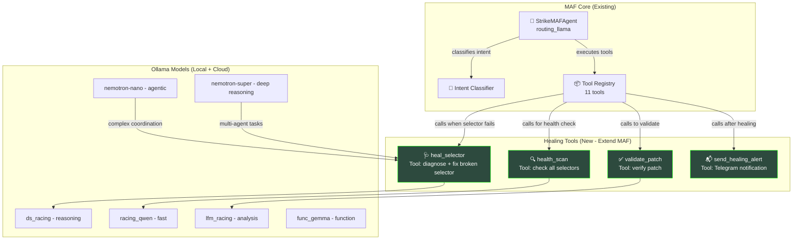
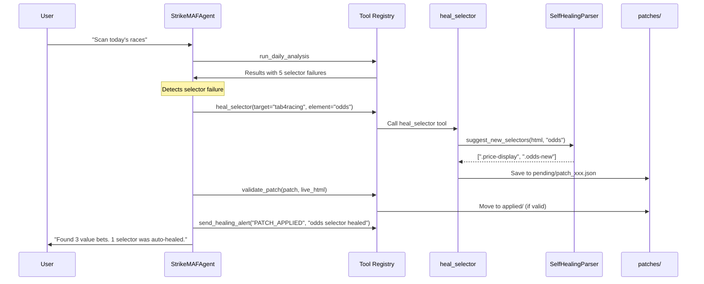

# MAF-Integrated Healing Swarm Architecture

## Overview

Extends the existing **MAF system** (StrikeMAFAgent + Tool Registry) with specialized healing agents that use the same Ollama models and tool patterns. Now includes **NVIDIA Nemotron-3** cloud models for complex multi-agent coordination.

## Available Models

### Local (Ollama)
| Model | Size | Use Case |
|-------|------|----------|
| `racing_llama` | 1.3 GB | Router/summaries |
| `racing_qwen` | 1.0 GB | Fast reads, bankroll |
| `func_gemma` | 300 MB | Write operations |
| `lfm_racing` | 731 MB | Deep analysis |
| `ds_racing` | 1.1 GB | Reasoning |

### Cloud (Ollama)
| Model | Size | Use Case |
|-------|------|----------|
| `nemotron-3-nano:30b` | 30B (3B active) | Fast agentic pipelines, rapid feedback |
| `nemotron-3-super` | 120B | Complex multi-agent coordination, deep reasoning |


### Nemotron-3 Architecture

**Nemotron-3-Nano (30B)**
- Architecture: Hybrid Mamba-2/Transformer with MoE
- 30B total parameters, activates 3B per token
- Toggle "thinking" on/off
- Ideal for: RTX 3090/4090, local RAG, efficient local agent

**Nemotron-3-Super (120B)**
- Architecture: Latent MoE (4 experts sharing core)
- 50% higher token generation than previous models
- Ideal for: Complex reasoning, multi-agent coordination

---

## Current MAF Architecture (What We Have)

## Current MAF Architecture (What We Have)

```
┌─────────────────────────────────────────────────────────┐
│                    StrikeMAFAgent                       │
│  • routing_llama → Intent Classifier                   │
│  • Tool Registry (11 tools)                            │
│  • Ollama: ds_racing, func_gemma, racing_qwen           │
└─────────────────────────────────────────────────────────┘
                            │
                            ▼
┌─────────────────────────────────────────────────────────┐
│                   TOOL REGISTRY (11)                     │
│  evaluate_race, calculate_probability_edge,             │
│  get_account_summary, record_selection,                 │
│  update_race_result, calculate_max_position,            │
│  search_past_races, search_racing_data,                 │
│  verify_race_exists, run_daily_analysis,                │
│  get_odds_snapshot                                      │
└─────────────────────────────────────────────────────────┘
```

## Integration: Healing Swarm as MAF Tools

Instead of separate agents, the healing swarm integrates as **specialized MAF tools** that can be invoked by the main StrikeMAFAgent.



## Model Tier Assignment (Updated)

| Task | Local Model | Cloud Model | Notes |
|------|-------------|-------------|-------|
| Intent Classification | racing_llama | - | Fast routing |
| Fast Reads/Bankroll | racing_qwen | nemotron-nano | Speed priority |
| Deep Analysis | lfm_racing | nemotron-super | Complex reasoning |
| Write Operations | func_gemma | - | Recording bets |
| Multi-agent Coordination | - | nemotron-super | Healing swarm |
| Agentic Tasks | - | nemotron-nano | Rapid feedback |

## MAF Tool Extensions for Healing

These tools extend the existing `maf_tool_registry.py`:

```python
# New healing tools to add to TOOL_REGISTRY

def heal_selector(
    target: Annotated[str, Field(description="Target scraper (tab4racing, pdf_harvester)")],
    element_type: Annotated[str, Field(description="Element type (odds, horse_name, jockey)")],
    failed_selector: Annotated[str, Field(description="The selector that failed")],
    html_sample: Annotated[str, Field(description="Current HTML sample")] = "",
) -> Dict[str, Any]:
    """
    Diagnose and repair broken selector.
    Uses SelfHealingParser + MAF reasoning to find new selector.
    """
    from skills.parsers.self_healing import SelfHealingParser
    
    parser = SelfHealingParser()
    
    # Get new selector suggestions
    suggestions = parser.suggest_new_selectors(html_sample, element_type)
    
    if not suggestions:
        return {
            "status": "NO_SUGGESTIONS",
            "message": "Could not find replacement selector",
            "action": "ADVISORY_MODE"
        }
    
    # Create patch
    patch = {
        "target": target,
        "element": element_type,
        "old_selector": failed_selector,
        "new_selector": suggestions[0],
        "confidence": 0.85,
        "created_at": datetime.now().isoformat(),
    }
    
    return {
        "status": "PATCH_GENERATED",
        "patch": patch,
        "suggestions": suggestions,
        "action": "VALIDATE_NEXT"
    }


def validate_patch(
    patch: Annotated[Dict, Field(description="Patch JSON to validate")],
    test_html: Annotated[str, Field(description="Live HTML to test against")] = "",
) -> Dict[str, Any]:
    """
    Validate a patch by testing on live HTML.
    Returns valid only if data format matches expected.
    """
    from bs4 import BeautifulSoup
    
    soup = BeautifulSoup(test_html, 'html.parser')
    new_selector = patch.get("new_selector", "")
    element = patch.get("element", "")
    
    # Test selector
    try:
        result = soup.select_one(new_selector)
    except:
        return {"status": "INVALID_SELECTOR", "valid": False}
    
    if not result:
        return {"status": "NO_MATCH", "valid": False}
    
    # Validate format based on element type
    text = result.get_text(strip=True)
    valid = True
    validation_msg = ""
    
    if element == "odds":
        try:
            val = float(text)
            if not (1.0 <= val <= 100.0):
                valid = False
                validation_msg = "Odds outside valid range 1.0-100.0"
        except:
            valid = False
            validation_msg = "Could not parse as decimal"
    
    elif element == "horse_name":
        if not re.match(r'^[A-Z][a-z]+', text):
            valid = False
            validation_msg = "Not a valid horse name format"
    
    return {
        "status": "VALID" if valid else "INVALID",
        "valid": valid,
        "tested_value": text[:50],
        "message": validation_msg if not valid else "Patch validated successfully"
    }


def health_scan() -> Dict[str, Any]:
    """
    Scan all selectors across all scrapers.
    Report health status and any failing selectors.
    """
    from skills.parsers.self_healing import SelfHealingParser
    
    parser = SelfHealingParser()
    stats = parser.get_selector_stats()
    
    # Identify failing selectors
    failing = []
    for element_type, stat in stats.items():
        if stat["success_rate"] < 50 and stat["total_attempts"] > 5:
            failing.append({
                "element": element_type,
                "success_rate": stat["success_rate"],
                "best_selector": stat["best_selector"],
                "recommendation": "HEAL_NEEDED"
            })
    
    return {
        "status": "HEALTH_REPORT",
        "total_elements": len(stats),
        "healthy": len(stats) - len(failing),
        "needs_attention": len(failing),
        "failing_selectors": failing,
        "overall_health": "GOOD" if len(failing) == 0 else "NEEDS_HEALING"
    }


def send_healing_alert(
    event_type: Annotated[str, Field(description="Event: PATCH_APPLIED, PATCH_REJECTED, SELECTOR_FAILED")],
    details: Annotated[str, Field(description="Details about the event")],
) -> Dict[str, Any]:
    """
    Send Telegram notification about healing events.
    """
    from skills.notifications.telegram_bot import TelegramNotifier
    
    emoji_map = {
        "PATCH_APPLIED": "✅",
        "PATCH_REJECTED": "❌",
        "SELECTOR_FAILED": "⚠️",
    }
    
    emoji = emoji_map.get(event_type, "📋")
    
    message = f"""
{emoji} <b>STRIKE TIPS - Healing Cloud</b>

<b>Event:</b> {event_type}
<b>Details:</b> {details}

<i>System is operating in {'ACTIVE' if event_type == 'PATCH_APPLIED' else 'ADVISORY'} mode.</i>
"""
    
    try:
        notifier = TelegramNotifier()
        result = notifier.send_message(message)
        return {"status": "SENT", "message": message[:200]}
    except Exception as e:
        return {"status": "FAILED", "error": str(e)}
```

## Integration Flow with MAF



## Updated Tool Registry

Add 4 new tools to the existing 11:

| Tool Name | Function | Model | Category |
|-----------|----------|-------|----------|
| `heal_selector` | Diagnose & fix broken selectors | lfm_racing | healing |
| `validate_patch` | Validate patch against live data | racing_qwen | healing |
| `health_scan` | Report all selector health | racing_llama | healing |
| `send_healing_alert` | Telegram notification | racing_qwen | notification |

## File Changes

1. **Extend** `maf_tool_registry.py` - Add 4 new healing tools
2. **Enhance** `self_healing.py` - Add consecutive failure tracking
3. **Create** `patches/` directory structure
4. **Update** `maf_agent.py` - Add healing intent handling

## Why This Aligns with MAF

- **Same Models**: Uses ds_racing, racing_qwen, lfm_racing already in MAF
- **Same Tool Pattern**: Tools follow same Pydantic Field schema pattern
- **Same Orchestration**: Goes through StrikeMAFAgent intent classifier
- **Extends Not Replaces**: MAF remains the router; healing is a specialized tool
- **Shared Memory**: ChromaDB session history works across all tools
