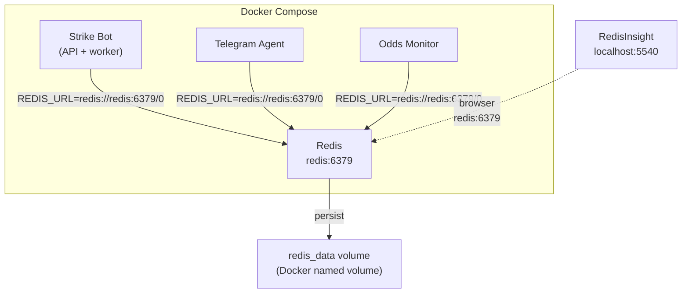
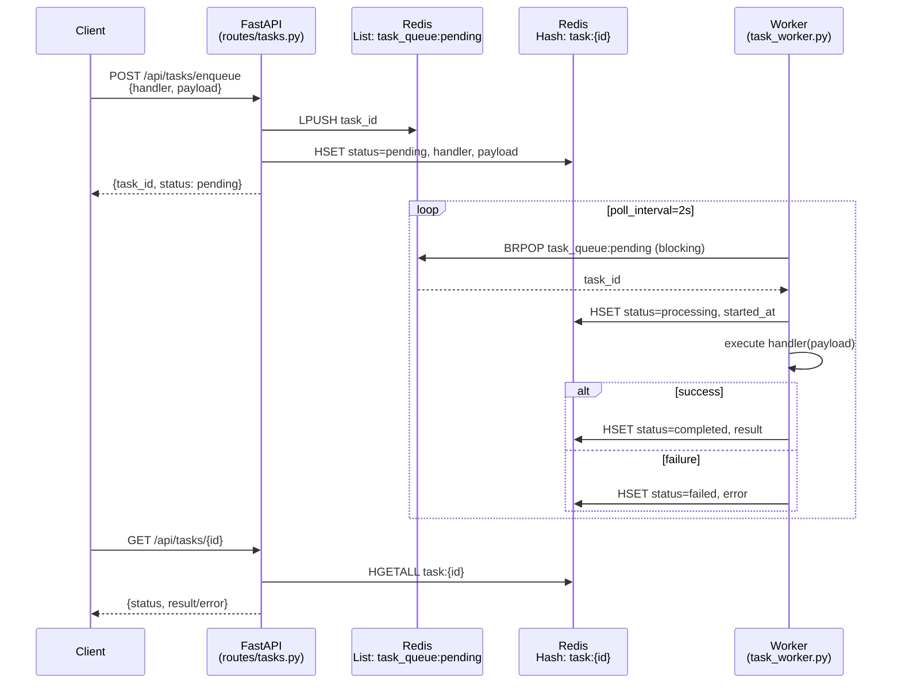
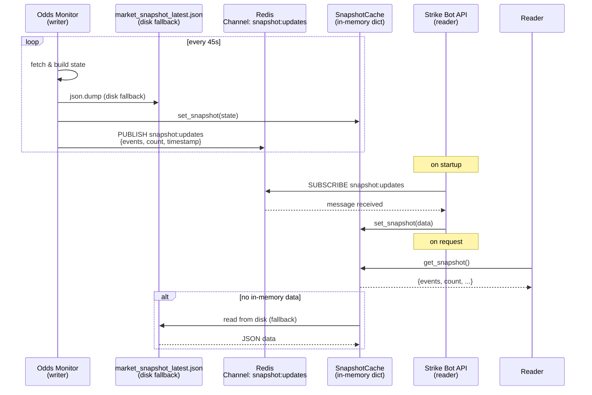

# Redis Architecture

Redis 8.x (Alpine) runs as a Docker service, shared across all three containers for task queuing and pub/sub snapshot distribution.

## Container Topology



All containers connect via Docker DNS (`redis:6379`), not `localhost`. Data survives restarts via the `redis_data` named volume.

---

## 1. Task Queue — Redis List + Hash

A FIFO async task queue backed by Redis lists and hashes. No Celery — pure `redis.asyncio`.

### Flow



### Key Structure

| Redis Key | Type | Purpose | TTL |
|---|---|---|---|
| `task_queue:pending` | List | FIFO queue of pending task IDs | ∞ |
| `task:{id}` | Hash | Task metadata + status/result | 7 days |

### Task Hash Fields

```
task:{id} → {
  "handler":   "daily_scan|pdf_sync|pre_warm|...",
  "payload":   JSON string,
  "status":    "pending|processing|completed|failed",
  "created_at": ISO timestamp,
  "started_at": ISO timestamp or "",
  "result":     JSON string or "",
  "error":      string or ""
}
```

### Registered Handlers (8)

| Handler | Purpose |
|---|---|
| `daily_scan` | Full daily racecard scan |
| `pdf_sync` | Sync PDF intelligence |
| `pre_warm` | Warm up models/caches |
| `scrape_track` | Scrape a single track |
| `heartbeat_insight` | Generate heartbeat insight |
| `odds_snapshot` | Capture odds snapshot |
| `race_analysis` | Run race analysis |
| `cleanup_cache` | Clean stale caches |

### Endpoints

| Method | Route | Description |
|---|---|---|
| `POST` | `/api/tasks/enqueue` | Enqueue a new task |
| `GET` | `/api/tasks/{id}` | Get task status/result |
| `GET` | `/api/tasks/` | List all tasks |
| `DELETE` | `/api/tasks/{id}` | Cancel a task |
| `GET` | `/api/tasks/queue/length` | Queue depth |

---

## 2. Snapshot Cache — Redis Pub/Sub

Replaces the old 5-second disk poll with push-based in-memory updates.

### Flow



### Module: `core_agent/core/snapshot_cache.py`

```
get_snapshot()       → returns in-memory dict (falls back to disk)
set_snapshot(data)   → updates in-memory dict
publish_snapshot(r, data) → publishes to Redis channel (async)
subscribe_snapshot(r)    → background subscriber coroutine
```

### Channel

| Channel | Payload | Publisher | Subscriber |
|---|---|---|---|
| `snapshot:updates` | JSON `{events, count, timestamp}` | `adaptive_odds_monitor.py` | `api.py` (startup) |

---

## 3. Files Summary

| File | Role |
|---|---|
| `core_agent/core/task_queue.py` | Redis connection, enqueue, dequeue, complete, fail, cancel |
| `core_agent/core/task_worker.py` | 8 handlers + worker loop |
| `core_agent/routes/tasks.py` | 5 FastAPI endpoints |
| `core_agent/core/snapshot_cache.py` | Pub/sub + in-memory cache |
| `core_agent/core/adaptive_odds_monitor.py` | Writer: publishes snapshot to Redis |
| `core_agent/api.py` | Wires worker + subscriber on startup |
| `docker-compose.yml` | Redis service + volumes + REDIS_URL per container |

---

## 4. Configuration

```yaml
# docker-compose.yml
redis:
  image: redis:alpine
  ports: ["6379:6379"]
  volumes: [redis_data:/data]
  restart: always

# Each container gets:
environment:
  - REDIS_URL=redis://redis:6379/0
```

```python
# core_agent/core/task_queue.py
REDIS_URL = os.getenv("REDIS_URL", "redis://localhost:6379/0")
```

---

## 5. RedisInsight

Available at `http://localhost:5540/`. Connect using hostname `redis` (port `6379`) — only `redis:6379` works from inside RedisInsight (Docker DNS). `127.0.0.1:6379` points to RedisInsight's own container, not Redis.
